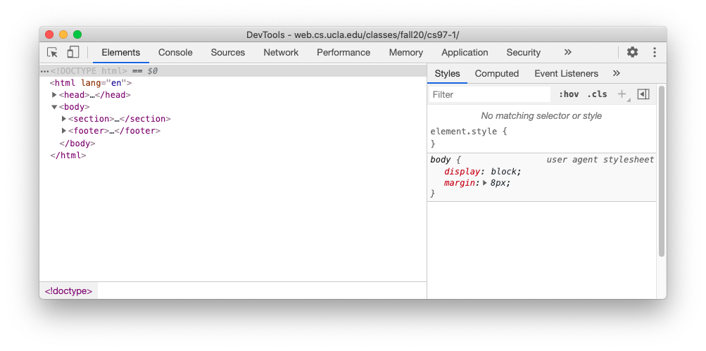

# Hackschool Session 1: Introduction to HTML/CSS

**Date**: October 14, 2020

**Location**: Zoom

**Teachers**: Jamie Liu, Miles Wu

## Resources

- [Slides](https://docs.google.com/presentation/d/1eZhKeaflOOm6lEzTwdoP3kiP7VwdmZspdIt77I1Yqiw/edit?usp=sharing)
- [ACM Membership Attendance Portal](http://members.uclaacm.com/login)

## What we'll be learning today
- [Basic Dev Environment Setup](#basic-dev-environment-setup)
- [HTML](#html)
- [CSS](#css)

---

## Basic Dev Environment Setup

### Browser With a Debugger

We highly recommend [Google Chrome](https://www.google.com/chrome).

### Text Editor

Use whatever text editor you are most comfortable with, there is no "best" text
editor. In this workshop we'll be using [VS Code](https://code.visualstudio.com/),
but here are some alternatives:

- Get [Sublime Text 3](https://www.sublimetext.com/).
- Get [Atom](https://atom.io/).

---

## HTML

### What is HTML?

HTML stands for Hyper Text Markup Language. 

**Hypertext** is just text that can have links (hyperlinks) to other text.
Though HTML can support things like images and tables now, the "hypertext" in
the name comes from what HTML was historically used for.

**Markup** comes from the idea of editors "marking up" paper manuscripts with
corrections as well as typographic instructions: make this heading larger, make
that word bold, etc. Similarly, we use "tags" in HTML to mark different parts
of our documents. These tags are used to describe the **structure** and
**content** of a page.

> HTML tags do not describe the style or appearance of a page, that's the job
> of CSS. Why have this separation? There are several reasons, including the following:
> - Different users have different devices/displays which may require the content to be formatted differently
> - Some people use screen readers, and HTML tags provide useful contextual and structural information

### What does HTML look like?

Let's look at the [Fall 2020 CS 97 course website](http://web.cs.ucla.edu/classes/fall20/cs97-1/) for an example.

In Google Chrome, right click and press "Inspect" to open the developer tools. Make sure the "Elements" tab is selected, and you should see something like this:



A few key elements that we see:
- `<!DOCTYPE html>`: tells our web browser (Google Chrome) that this is an HTML
  document
- `<html>`: shows where the HTML content is
- `<head>`: contains information that isn't displayed in the webpage (like the title)
- `<body>`: surrounds visible content on the webpage

What other tags can we find?
- `<h1>`, `<p>`, `<ul>`, ...

### Let's experiment with HTML!

1. Make a new folder and open it in your preferred text editor.
2. In the folder, create a new file named `index.html`
3. Copy and paste the following code into your file, and Save.
   ```html
   <!DOCTYPE html>
   <html>
     <head>
     </head>
     <body>
     </body>
   </html>
   ```

#### Whitespace and Indentation

Try typing some lines of text in the `<body>` section. For example:

```html
<body>
 hello
   hi

 hey
</body>
```

Whitespace and indentation do not matter in HTML. However, indenting your code
neatly makes it more readable and clean!

#### Tag: `<br>`

This tag specifies a line break.

```html
hello <br>
hi
```

#### Comments

Comments in HTML are surrounded by `<!--` and `-->`.

```html
<!-- a comment in HTML -->
```

#### Tag: `<title>`

The `<title>` tag is used to define the title for the page. This is the title
that labels the tab in your browser and is also used for search results.

Since this tag doesn't define any content that should appear in the webpage
itself, we should put it in the `<head>` section.

```html
<title>my amazing website</title>
```

#### Tag: Headers

There are 6 header tags from `<h1>` to `<h6>`. The `<h1>` tag is the largest/most important, while the `<h6>` tag is the smallest/least important.

Header tags are used for section headers or other important information.

```html
<h1>i am Big</h1>
<h6>i am smol</h6>
```

#### Tag: `<p>`

The `<p>` or paragraph tag indicates paragraphs.

```html
<p>this is a paragraph of text</p>
<p>this is another paragraph</p>
```

- You can use the `<strong>` and `<em>` tags to indicate that the enclosed text is "strong" or should be "emphasized".
  - You might be wondering: Doesn't this change the style? I thought HTML isn't supposed to specify style! For more on that, read [this Stack Overflow answer](https://stackoverflow.com/a/271776).

#### Tag: `<button>`

This tag creates a button element.

```html
<button>i am a button</button>
```

#### Tag: `<a>`

The `<a>` tag is used for hyperlinks, and the destination of the link is
specified with an `href` **attribute**.

```html
<a href="https://github.com">this is a link to GitHub</a>
```

#### Tag: ``

You can use the `` tag to insert an image, specified by the `src` attribute. This source can be either an online image URL or a path to a local image.

```html


```

- the `` tag does not require a closing tag
- the `` tag also has other attributes you can specify
  - `alt`: alternate text to describe an image
  - `height`: set the height of the image

#### Tag: Lists

In HTML, there are ordered lists `<ol>` and unordered lists `<ul>`. Each list item gets an `<li>` tag.

```html
my favorite trees:
<ol>
  <li>japanese maple</li>
  <li>cherry blossom</li>
  <li>redwood</li>
</ol>

some cool people (in no particular order):
<ul>
  <li>Galen</li>
  <li>Shirly</li>
  <li>Asha</li>
</ul>
```

#### Tag: Inputs

The `<input>` tag supports [many different types of inputs](https://developer.mozilla.org/en-US/docs/Web/HTML/Element/input).

```html
<form>
  <input type="text" placeholder="write stuff here">
  <input type="range">
</form>
```

- `<input>` tags don't have closing tags

### HTML Activity

Make a basic website about yourself! Feel free to look at [this list of HTML
elements](https://developer.mozilla.org/en-US/docs/Web/HTML/Element) and
experiment with various HTML tags and attributes.

Some ideas for things you can include in your webpage are:
- pictures of pets
- favorite foods
- hobbies
- fun facts
- links to social media
- whatever you want!

---

## CSS