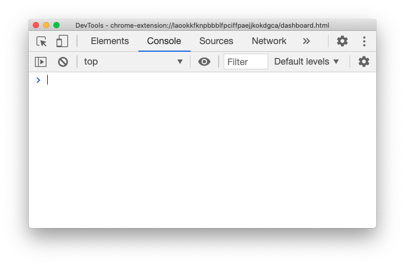
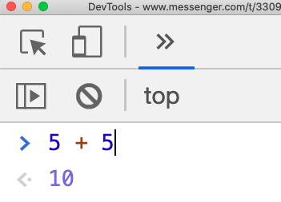
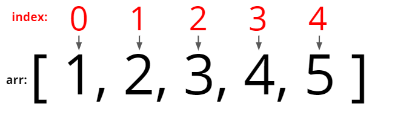
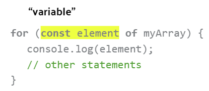
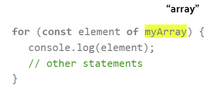
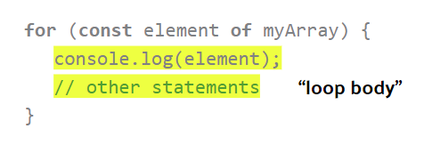

<!-- omit in toc -->

# Hackschool Session 2: Introduction to JavaScript

**Date**: October 21, 2020

**Location**: Zoom

**Teachers**: [Jamie Liu](https://github.com/jamieliu386), [Miles Wu](https://github.com/milesswu)

<!-- omit in toc -->
## Resources

- [Slides](https://docs.google.com/presentation/d/1UZ6EJ3UNhUvtJgBLDvHp0iAZ_1ReLZrjov1a5ujeiT8/edit?usp=sharing)
- [ACM Membership Attendance Portal](http://members.uclaacm.com/login)

<!-- omit in toc -->
## What we'll be learning today

- [Hackschool Session 2: Introduction to JavaScript](#hackschool-session-2-introduction-to-javascript)
  - [DOM API Sneak Preview](#dom-api-sneak-preview)
  - [JavaScript](#javascript)
    - [`console.log()`](#consolelog)
    - [Comments](#comments)
    - [Types and Values](#types-and-values)
    - [Variables](#variables)
    - [Functions](#functions)
    - [Conditionals](#conditionals)
    - [Objects](#objects)
    - [Arrays](#arrays)

## DOM API Sneak Preview

Before we learn about JavaScript, let's talk about why we're learning it! Last
week we learned that websites are built with HTML, CSS, and JavaScript. JavaScript
is used to make interactive elements on a webpage. Let's see an example of that.

Go to [ACM @ UCLA's website](https://uclaacm.com), and you'll see something like
this:


Right click on the page and press "Inspect". In the console, we're going
to paste and Enter the following code:

```js
document.getElementsByClassName('title')[0].onclick = () => {
    document.getElementsByClassName('title')[0].innerHTML = 'beep beep';
};
```

Now, if we click on "code the future.", we should see the text change to this:


This is the power of JavaScript. It makes elements interactive and creates a
more engaging experience for users! We'll learn more about using JavaScript
to create fun interactions in next week's workshop, but today we'll be learning
foundations of JavaScript to prepare!

## JavaScript

To execute lines of JavaScript, we'll be using the Chrome Developer Tools:

1. Open a tab in Google Chrome
2. Right click and press Inspect
3. Select the "Console" tab (don't worry if you see some red warnings or output)



To execute a line of code, type it into the console and press "Enter". 

Some important things about the console:
- When you type JavaScript into the console, it will show the result/value of your
  code before you press enter. For example:

  
- When you run lines of JavaScript in the console, the console "remembers" the
  previous lines you've run in the session.
- You can use your "up" arrow to find and run previous lines of code you've run.

<!-- omit in toc -->
### Before we get started...

We highly recommend **against** trying to code along in your own console, since
it might be hard to absorb what we're saying if you're trying to code at the
same time! Instead, we recommend you take some notes about any concepts that
are new to you, since you can always review the code we wrote at a later time.

This is a lot of material, especially if you're new to programming (the
concepts we're teaching this workshop would usually take multiple CS 31
lectures to cover). It's totally ok and normal if you feel lost or don't get
everything we teach during the workshop. Just try to get however much you can,
and know that learning how to code is a long process that you should take at
your own pace!

### `console.log()`

Throughout this workshop, we'll be using `console.log()` to print stuff out to
our console. This prints out whatever we put inside the parentheses. For example,
`console.log("Hello, world!")` will print `Hello, world!` to the console.

### Comments

In JavaScript, there are two ways to write comments:

```js
// This is a single line comment.

/*
This is a
multiline comment
*/
```

Comment don't affect how the code runs, but can be useful for "annotating"
your code.

### Types and Values

In JavaScript, there are several basic types of values we can use: numbers,
booleans, and strings.

#### Numbers

```js
420         // integers
3.14159263  // decimals
-273.15     // negative numbers
6.02e23     // we can use scientific notation, too!
```

We can also perform operations on values:

```js
/* arithmetic */
> 6 + 9   // addition
< 17

> 6 - 9   // subtraction
< -3

> 6 * 9   // multiplication
< 54

> 6 / 9   // division
< 0.6666666666666666
```

```js
/* comparision */
> 5 === 6   // equality
< false

> 5 !== 6   // inequality
< true

> 5 < 6     // less than
< true

> 5 > 6     // greater than
< false

> 5 <= 6    // less than or equal to
< true

> 5 >= 6    // greater than or equal to
< false
```

Note: If you're familiar with other programming languages (like C++, Python,
etc.), you might be wondering why we use `===` and `!==` in JavaScript instead
of `==` and `!=`. In JavaScript, `===` and `!==` are not the same as `==` and `!=`. We recommend you always use `===` and `!==` when writing JavaScript.

#### Booleans

Booleans can only have two values: `true` and `false`. We can use logical operators
with booleans: "NOT" (`!`), "AND" (`&&`), and "OR" (`||`).

```js
/* NOT */
> !true
< false

> !false
< true

/* AND */
> true && true
< true

> true && false
< false

> false && false
< false

/* OR */
> true || true
< true

> true || false
< true

> false || false
< false
```

#### Strings

A string is just a sequence of characters inside of quotes. Either
single quotes or double quotes will work (in some other programming languages,
single quotes and double quotes mean different things).

```js
"1234"
"I love boba"
"Halloween is approaching!! ooOoOOo scary"
```

We can concatenate (join) strings together using the `+` operator:

```js
> "My favorite boba is " + "boba"
< "My favorite boba is boba"
```

We can also compare strings for equality/inequality (this comparison is
case-sensitive):

```js
> "Hello" === "Hello"
< true

> "HI" !== "hi"
< true
```

#### Practice

What will get printed in each of these questions? (Try to figure it out
without actually running the code.)

1. `console.log(1 + 11)`
2. `console.log("1" + "11")`
3. `console.log("hello" !== "HELLO")`
4. `console.log(5 === 8)`
5. `console.log(!true)`
6. `console.log((4 < 6) && (8 !== 10))`

<details>
   <summary>Solutions:</summary>
   <ol>
      <li><code>12</code></li>
      <li><code>111</code></li>
      <li><code>true</code></li>
      <li><code>false</code></li>
      <li><code>false</code></li>
      <li><code>true</code></li>
   </ol>
</details>

### Variables

Sometimes it can be convenient to store a value and reuse it without having to
type the same value over and over again. It can also be convenient to give
certain values names that describe what they are.

This is what variables are used for! Variables give us a way to refer to values
by a name.

#### Creating Variables

We can **declare** a variable using `let`:

```js
let name;
// note: in JavaScript, the semi-colon (;) is optional
// we will always use it in order to be consistent
```

We can then **assign** a value to the variable using `=`:

```js
name = "jamie";
```

We can also **change** a variable's value using `=` to re-assign the value:

```js
name = "miles";
```

We can also declare a variable and assign it a value in a single line:

```js
let age = 21;
```

#### Using Variables

```js
let myName = "jamie";
console.log("Hello, " + myName);

let x = 2;
console.log(x * x);
```

#### Constants

If you don't want your variable's value to change, you can declare it using
the `const` keyword instead of `let`:

```js
const pi = 3.14;
```

If you later try to assign a new value to this constant, you'll get an error.

```js
> pi = 3.141592653;
< Uncaught TypeError: Assignment to constant variable.
```

#### Practice

What will be printed to the console in each of these questions?

1. ```js
   let width = 10;
   let height = 2;
   console.log(width * height);
   ```
2. ```js
   let iLoveBoba = true;
   let bobaIsGood = true;
   console.log(iLoveBoba && bobaIsGood);
   ```
3. ```js
   let today = "Wednesday";
   console.log("Today is " + today);
   ```
4. ```js
   let uclaScore = 100;
   let uscScore = 0;
   console.log(uclaScore > uscScore);
   ```

<details>
   <summary>Solutions:</summary>
   <ol>
      <li><code>20</code></li>
      <li><code>true</code></li>
      <li><code>Today is Wednesday</code></li>
      <li><code>true</code></li>
   </ol>
</details>

### Functions

#### Motivation

Imagine I want to write some code to print a bunch of different bobas I like.
I might write something like this:

```js
console.log("I really like thai tea with boba.");
console.log("I really like roasted oolong tea with boba.");
console.log("I really like milk tea with boba.");
console.log("I really like okinawa pearl milk tea with boba.");
console.log("I really like coffee milk tea with boba.");
// ... you get the idea
```

You can see there's a lot of repetition here! What if I wrote all this code and
then decided I wanted them all to say "I genuinely adore ... with boba!"? Then
I'd need to edit every single line to reflect those changes. That'd be a total
pain!!

#### Function Basics

That's where functions come in!

A function is something that performs an action (this sounds horribly vague,
but hopefully some examples help clear things up). A function can have inputs
(we call them **arguments**), and a function can have an output (we then say
that it **returns** a value).

Let's see what functions look like! There are two ways to write functions in
JavaScript:

```js
// first way
const myFunction = (arg1, arg2) => {
  // stuff the function does
};

// second way
function myFunction(arg1, arg2) {
  // stuff the function does
};
```

In this workshop we will be using first way! Let's take a closer look at each
part of the function:

```js
const myFunction = (arg1, arg2) => {
  // stuff the function does
};
```

- "`const myFunction =`": declares a constant named "myFunction", and assigns it
- "`(arg1, arg2)`": names the two arguments the function accepts
- "`=>`": I think of the arrow as saying "goes to"
- the function's body goes inside the braces: this is where the actual work happens
- remember the semi-colon at the end!

#### Example: `helloWorld`

Let's write a function named `helloWorld` that prints "Hello, world!":

```js
const helloWorld = () => {
  console.log("Hello, world!");
};
```

Note that this function does not take in any arguments, but we still include the
parentheses!

Let's try calling (using) the function. We do this by saying the function name
followed by parentheses:

```js
helloWorld();
```

#### Example: `helloName`

Let's write a function called `helloName` that says hello to a name that we pass in:

```js
const helloName = (name) => {
  console.log("Hello, " + name);
};
```

Now we'll call our function. Since the function needs an argument, we'll give
it an argument in the parentheses:

```js
helloName("Jamie");
```

#### Example: `triple`

Let's write a function named `triple` that triples a numeric input:

```js
const triple = (x) => {
  x * 3;
};
```

Now let's call (use) the function to compute what triple 5 is:

```js
> triple(5);
< undefined
```

Uh oh, all we got back was undefined! What happened? We never returned the answer
in our function! Let's fix that:

```js
const tripleWithReturn = (x) => {
  return x * 3;
};
```

Now when we call the function, it returns a value!

```js
> tripleWithReturn(5);
< 15
```

However, we can't do much with the value, since we don't save it anywhere. Let's
make a variable that stores the answer so we can use it later:

```js
const tripleFive = tripleWithReturn(5);
console.log(tripleFive);
```

Remember to always return a value in your function if you want to use it later!

#### Example: `helloNameWithReturn`

Let's write another version of `helloName`, but instead of printing the message,
return it!

```js
const helloNameWithReturn = (name) => {
  return "Hello, " + name;
};
```

```js
const msg = helloNameWithReturn("jamie");
console.log(msg);
```

#### Example: `loveBoba`

Let's write a function to solve [our problem from earlier](#motivation):

```js
const loveBoba = (drink) => {
  console.log("I really like " + drink + " with boba.");
};
```

Now I could proclaim my love for boba like this:

```js
loveBoba("thai tea");
loveBoba("roasted oolong tea");
loveBoba("milk tea");
loveBoba("okinawa pearl milk tea");
loveBoba("coffee milk tea");
```

If I decided I wanted it to say "I genuinely adore ..." instead, I would only
need to edit a single line in the function!

#### Example: `bobaBudget`

Let's write a function called `bobaBudget` that has two arguments:
- `budget`: how much money I can spend on boba
- `numBoba`: the number of bobas I've bought already

The function should print out how many bobas I can still buy (fractions of boba
is fine). We'll assume that boba costs $4 always.

```js
const bobaBudget = (budget, numBoba) => {
  const spent = numBoba * 4;           // how much money I've spent
  const remaining = budget - spent;    // how much money I have left
  const canBuy = remaining / 4;        // how many bobas I can buy
  console.log("You can buy " + canBuy + " more bobas.");
};
```

Note: 
- In our `console.log`, we added a number to strings! This works because JavaScript
  converts the number to a string and the joins the strings together.
- We can create variables inside of our functions! This can make it easier to
  read and understand what our function does. Try to give your variables and
  functions informative names to make them easier to understand.

Let's try calling our function:

```js
bobaBudget(100, 2);
```

#### Practice

What will get printed when the code in each question is run?

1. ```js
   const foo = (n) => {
     return n + 2
   };

   const mystery = (n) => {
     return foo(n * 2) + foo(n)
   };
   console.log(mystery(10));
   ```
2. ```js
   const peep = (s) => {
     console.log(s + " peep");
     return "peep";
   };

   const baz = (s) => {
     console.log(peep(s));
   };

   baz("Jamie");
   ```
3. ```js
   const yep = (n) => {
     return n + 2;
   };
   const oh = (n) => {
     return n * 3;
   };
   const pop = (n) => {
     return n - 7;
   };
   const yop = (y, o, p) => {
     return yep(y) + oh(o) + pop(p);
   };

   console.log(yop(5, 2, 3));
   ```
4. ```js
   const nah = (s) => {
     console.log(s + s);
   };
   const nope = (s) => {
     console.log(s + "!!!");
   };
   const no = (en, oh) => {
     nah(oh);
     nope(en);
   };
   no("jam", "bred");
   ```

<details>
   <summary>Solutions:</summary>

   1. `34`
   2. ```
      "Jamie peep"
      "peep"
      ```
   3. `9`
   4. ```
      "bredbred"
      "jam!!!"
      ```

</details>

### Conditionals

In programming, conditionals are a tool used to define branching paths in the code. The path taken depends on the result of some condition.

In a more tangible sense, you can think of this as decision making based on dyanmic factors. For example, if you were considering whether or not to study for a class, one of the factors you might consider is whether you have an exam coming up soon. If you do have an exam soon, you will choose to study, otherwise you will go watch Netflix.

Let's take this concept and see how it is applied in the code!

#### Simple `if` statement

The most basic way to introduce a conditional is using the `if` statement. The syntax for this looks like:

```js
if (condition) {
	// actions if true
}
```

Here, the `condition` refers to some true/false value. So any expression that would evaluate to either true or false could act as a condition (ex: `false`, `1 < 2`, `"a" === "a"`, etc).

The `if` statement essentially says to run the following code if the `condition` evaluates to true.

#### The `if-else` statement

The `if-else` statement is very similar to the `if` statement, but it also supplies the code that should run if the `condition` evaluates to false.

Here's a look at the syntax:

```js
if (condition) {
	// actions if true
} else {
	// actions if false
}
```

This pattern is more in line with our analogy of studying vs watching Netflix. If the `condition` is whether an exam is coming up, we will choose to either study or watch Netflix based on the result of that `condition`.

#### The `if-elseif-else` ladder

Finally, if we have a lot of different conditions to test and a lot of different actions corresponding to each condition, then we want to use an `if-elseif-else` ladder.

As the name implies, this pattern often looks like a ladder in the code. As shown below:

```js
if (cond1) {
	// actions if cond1 is true
} else if (cond2) {
	// actions if cond2 is true
} else if (cond3) {
	// actions if cond3 is true
} else {
	// actions if none are true
}
```

The way this code executes is top-down. First, the `if` condition will be tested and if it evaluates to `true`, the corresponding code block will run. If it evaluates to `false`, we try the next `else-if` condition and run the corresponding code if `true`. This process repeats until either one of the conditions evaluates to `true` or we get to the `else` block. Getting to the `else` means that none of the previous conditions were true.

NOTE: Using an `if-elseif` ladder implies that all of the different paths are mutually exclusive. Only one of the code blocks will actually run, after that we move on past the conditional statements. This means that if any of the conditions evaluates to `true` we do not keep testing the next condition, we just move on with the rest of our program.

#### Practice 
What is the output of the following pieces of code?

1. ```js
   const greeting = "hi"
   if (greeting === "hi") {
     console.log("hello!");
   }
   ```
1. ```js
   const testScore = 50;
   if (testScore > 60) {
     console.log("You passed!");
   } 
   else {
     console.log("You failed :(");
   }
   ```
1. ```js
   const testScore = 95;
   if (testScore >= 90) {
     console.log("You got an A!");
   }

   if (testScore >= 80) {
     console.log("You got a B!");
   }

   if (testScore >= 70) {
     console.log("You got a C");
   }

   if (testScore >= 60) {
     console.lof("You got a D");
   }

   if (testScore < 60) {
     console.log("You failed :(");
   }
   ```

1. ```js
   const testScore = 80;
   if (testScore >= 90) {
     console.log("You got an A!");
   }
   else if (testScore >= 80) {
     console.log("You got a B!");
   }
   else if (testScore >= 70) {
     console.log("You got a C");
   }
   else if (testScore >= 60) {
     console.lof("You got a D");
   }
   else {
     console.log("You failed :(");
   }
   ```

<details>
  <summary>Solutions: </summary>
 
 1. `"hello"`
 2. `"You failed :("`
 3. ```
    "You got an A!"
    "You got a B!"
    "You got a C"
    "You got a D"
    ```
4. `"You got a B!"`

</details>

### Objects
So far, we've only dealt with individual values being stored in variables for later use. But sometimes it is useful for us to want to keep a lot of related data together. For example, if you were recruiting for your club, you might want to group all of an applicant's information together.

We can do this by creating an object in JavaScript, which looks like this:

```js
const applicant = {
	email: "exampleemail@example.com",
	gpa: 3.0,
};
```

Let's break down the parts of this object so we can better understand how it works.

#### Object Properties

Every object consists of a set of key-value pairs. We refer to these keys as properties.

For example, the following object has two properties, `email` and `gpa`.

```js
const applicant = {
	email: "exampleemail@example.com",
	gpa: 3.0,
};
```

Properties can have any name you want, but often act as an appropriate label for the data it corresponds to.

#### Object Values

Every property in an object is associated with a value. This is the actual data being stored in the object.

In the same example, the value corresponding to the `gpa` property is `3.0`:

```js
const applicant = {
	email: "exampleemail@example.com",
	gpa: 3.0,
};
```

Object values can be of any type: number, string, boolean, etc. We can even have another nested object inside!


#### Accessing Object Properties
Now that we have all this data inside of an object, how do we "get a hold of" it? For example if we now want to store an individual item in the object inside a variable.

There are two ways of accessing an object properties: dot notation and bracket notation. Let's take a look at the syntax of each one.

Dot Notation:
```js
// myobj.propertyName
let gpa = applicant.gpa;
console.log(gpa); // prints "3.0"
```

Bracket Notation:
```js
// myobj["propertyName"]
let gpa = applicant["gpa"];
console.log(gpa); // prints "3.0"
```

#### Modifying/Deleting Object Properties
We can also use the dot and bracket notations to modify or remove properties within an object.

Dot Notation:
```js
// change email property
applicant.email = "joebruin@ucla.edu";
console.log(applicant.email); // prints "joebruin@ucla.edu"

// remove gpa property
delete applicant.gpa;
console.log(applicant); // gpa property gone
```

Bracket Notation:
```js
// change email property
applicant["email"] = "joebruin@ucla.edu";
console.log(applicant["email"]); // prints "joebruin@ucla.edu"

// remove gpa property
delete applicant["gpa"];
console.log(applicant); // gpa property gone
```

#### Object Methods
In some cases, it also makes sense to associate certain actions with an object. This is where object methods come in. An object method is essentially just a function attached to a specific object.

To use our previous example of having an applicant object, we can define the following:
```js
const applicant = {
	email: "exampleemail@example.com",
	gpa: 3.0,
	accept: () => {
		console.log("Congrats on being accepted!");
	}
}
```

Now our applicant object has an associated `accept` method, likely representing a recruiter's choice to accept them for the applied position.

We can call this method using dot notation:
```js
// obj.methodName()
applicant.accept(); // prints "Congrats on being accepted!"
```

That's all the basics of objects, if you want to learn more you can visit the docs [here](https://developer.mozilla.org/en-US/docs/Learn/JavaScript/Objects/Basics).

#### Practice 
In all of the below questions, use the following object to determine the output:
```js
  const student = {
    name: "Joe Bruin",
    email: "joebruin@ucla.edu",
    UID: 123456789,
    isTrueBruin: true,
    favDiningHall: "BPlate"
  }
```

1. ```js
   console.log(student.name);
   console.log(student["UID"]);
   ```
2. ```js
   if (student.isTrueBruin) {
     console.log("Let's do an 8-clap for " + student.name + "!");
   } else {
     console.log("Check out our True Bruin traditions to become a True Bruin! Be True Be You!");
   }
   ```
3. ```js
   const goEatLunch = (diningHall) => {
     console.log("I love to eat at " + diningHall);
   }
   goEatLunch(student.favDiningHall);
   ```
4. ```js
   student.name = "Josie Bruin";
   student.UID = 987654321;
   console.log(student);
   ```

<details>
  <summary>Solutions:</summary>

  1. ```
     "Joe Bruin"
     "123456789"
     ```
  2. `"Let's do an 8-clap for Joe Bruin!"`
  3. `"I love to eat at BPlate"`
  4. ```js
     {
       name: "Josie Bruin",
       email: "joebruin@ucla.edu",
       UID: 987654321
     }
     ```

</details>

### Arrays
So now with objects we have a way to group related data together in a meaningful way (using key-value pairs). But this does not always make sense to do. For example if we ran a restuarant and collected rating scores out of 5 stars, it wouldn't make as much sense to assign some label/key to each rating. That would look something like:
```js
const ratings = {
	rating1: 3,
	rating2: 5,
	rating3: 4
	// and so on
}
```

In these situations where we want to store a large amount of related data but don't necessarily need meaningful labels for each piece of data, we can use arrays.

#### What is an Array?
An array can be simply described as a collection of values stored in a sequential manner. Each item in an array is usually referred to as an **"element"**. 

Here are some examples of what arrays can look like:
```js
let arr = []; // empty array
let ratings = [3, 5, 4, 4];
let stores = ["Ralphs", "Target", "Trader Joe's"];
let randomItems = [42, "Lightning McQueen", false, 365.25];
```

#### Accessing Array Elements
Just like with objects, we can access the individual items within an array. However, since arrays do not have keys, we use indices to access array elements.

An array index is just a number which references the element being accessed. Indices start as zero, as shown below:



So if I wanted to get the first element of some array, I would write something like this:
```js
let index = 0;
let arr = [1, 2, 3, 4];
let firstElement = arr[index];
console.log(firstElement); // prints "1"
```

#### Basic Array Operations
Here are some operations you can perform on JavaScript arrays. You can learn more about arrays [here](https://developer.mozilla.org/en-US/docs/Web/JavaScript/Reference/Global_Objects/Array).

- `arr.length`: gives the number of elements in the array
- `arr.push(someValue)`: add an item to the end of the array
- `arr.pop()`: remove the last item from the array
- `arr.indexOf(someValue)`: get the index of a specific element in the array

#### Traversing Arrays
Often times when we have data in arrays, we will need to go through each element and do something with each one. For example, if we have an array of test scores, we might want to sum up all the test scores so that we can calculate an average!

Therefore, we need to introduce a new tool to help us go through arrays element by element (traverse arrays).

#### The `for-of` loop
We can use a tool called a loop to accomplish the task of traversing an array. It is called a loop since the code inside of it will repeat for every element in an array. Let's see what that looks like!

```js
for (const element of myArray) {
	console.log(element); // prints a new element each iteration
	//other statements
}
```

Above is an example of how we would use a `for-of` loop on an array. Let's break this down.

The first part of the `for` statement creates a variable called `element`. This variable will be used to reference the different elements in the array as the loop runs.



We then reference which array we want to loop through:



Everything in the following code block is called the "loop body" and will run each time the loop repeats.



To read this statement literally, you can say "for every element of myArray, perform the following actions".

To illustrate what this is doing, let's take a look at an example with our `testScores` array:
```js
let testScores = [89.9, 45.2, 68.4, 77.5];
for (const score in testScores) {
	console.log(score);
}
```

The loop shown is going to run once for every element in the `testScores` array (so 4 times). The first time the loop body runs, `score` will take the value of `89.9` (the first element in the array). We log the score to the console, outputting "89.9". 

The loop then repeats, this time `score` takes the value of the second element: `45.2`. We log again, and this process repeats.

In this way, we can go through our entire array element by element and perform the same actions on each one no matter how large our array is.

If you imagine our `testScores` array containing 1000 different test scores, then using this loop would be much easier than accessing each element individually using the `testScores[index]` method.

#### Practice
What is the output of the following code?

1. ```js
   const monthlyExpenses = ["150.30", "215.70", "170"];
   console.log(monthlyExpenses[1]);
   monthlyExpenses.push("240");
   console.log(monthlyExpenses.length);
   ```
2. ```js
   const ratings = [2, 5, 3, 4, 2];
   console.log(ratings[ratings.length - 3]);
   ```
3. ```js
   const greetings = ["hi", "yo", "what is up?", "what's gucci"];
   greetings.pop();
   for (greeting of greetings) {
     console.log(greeting);
   }
   ```

<details>
  <summary>Solutions: </summary>

  1. ```
     "215.70"
     "4"
     ```
  2. `"3"`
  3. ```
     "hi"
     "yo"
     "what is up?"
     ```

</details>

