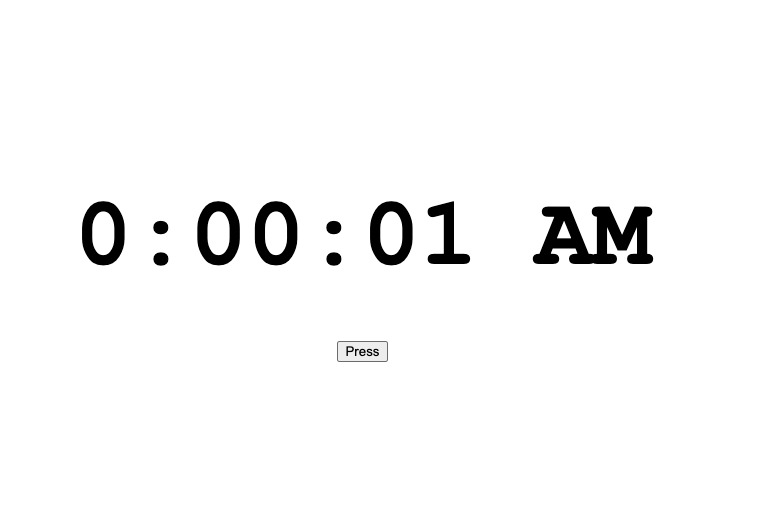
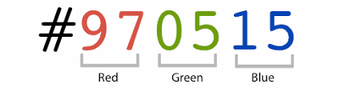

<!-- omit in toc -->
# Hackschool Session 3: Webpage Interaction with the DOM

**Date**: October 28, 2020

**Location**: Zoom

**Teacher**: Galen Wong ([@GalenWong](https://github.com/GalenWong))

<!-- omit in toc -->
## Resources

- [Slides](https://docs.google.com/presentation/d/1UZ6EJ3UNhUvtJgBLDvHp0iAZ_1ReLZrjov1a5ujeiT8/edit?usp=sharing)
- [ACM Membership Attendance Portal](http://members.uclaacm.com/login)
- 
<!-- omit in toc -->
## What we'll be learning today


+ [Linking JavaScript to HTML](#linking-javascript-to-html)
+ [What is the DOM?](#what-is-the-dom)
  + [Accessing individual elements](#accessing-individual-elements)
  + [Manipulating the elements](#manipulating-the-elements)
  + [A little detour: how are colors represented in a computer?](#a-little-detour-how-are-colors-represented-in-a-computer)
  + [Scheduling for things to happen](#scheduling-for-things-to-happen)
  + [Listening and reacting to events](#listening-and-reacting-to-events)
+ [Summary](#summary)
+ [⚡️ Challenges](#️-challenges)


Today we will base our workshop off some starter code in
[demo-starter](./demo-starter). If you would like to follow along, [download
the file](./demo-starter.zip)! It has a HTML and a CSS file. If you open the HTML file in the
browser, it looks like this:

<div align=center>
    
</div>


## Linking JavaScript to HTML

Last time, we had SO MUCH FUN coding in JavaScript in the console. But once
you close the browser window, it is gone forever (like my ex. who am I
kidding... I don't have one). So you would have to type it in the console
again. Frustrating... no... actually we don't need to.

Let's create a JavaScript file under the same folder that holds `index.html`
and name it `script.js`. Inside, we will put a line of simple JavaScript:

```js
console.log("If you see this in browser, that means our script is running.");
```

To use this JavaScript code file in our webpage, we need to link it to our 
HTML. Here, we introduce a new HTML tag called `<script>`:

```html
<body>
  <div id="clock-face">0:00:01 AM</div> 
  <div class="btn-container">
    <button class="btn">Press</button>
  </div>
  <!-- We add the following line -->
  <script src="script.js"></script>
</body>
```

Now, if you open the HTML `index.html` in your browser and launch the
console, you will see our `console.log` is executed. That means we have
linked our JavaScript file to the HTML successfully.

> 🚩 Checkpoint: Link the JavaScript file and see the `console.log` output in
the console.

## What is the DOM?

DOM stands for **Document Object Model**. It is a programming model that
represents documents as objects. In our case, our document is the HTML
document. The object here refers to the JavaScript object that we learned
last time.

This means that we can store an HTML element (each tag is an element) as a
variable in JavaScript and manipulate it as an object.

Still sounds very vague right? Let's put this in concrete code. The DOM means
that the browser defines a `document` object for you. You can print it out 
in the console:

```js
console.log(document);
```

This `document` object in facts represents the entire webpage itself as an
object. This is not that useful though, since we want to access the
individual elements.

### Accessing individual elements

"Access" means "getting hold of something" or "store something as a variable".

`document` refers to the entire webpage. To access certain elements within
the webpage, the `document` object provides a convenient method for us to
use. It is called `querySelector`. It takes in a string as the input
parameter. In your console, run:

```js
console.log(document.querySelector("button"));
```

Since our webpage contains a button, `document.querySelector("button")`
returns an object representing that button. What is the string that we 
pass into `querySelector`? It is actually a CSS selector. Recall from last time, we learned three ways to select elements in CSS:

```css
/* with tag name */
button {
    color: blue;
}

/* with an ID */
#clock-face {
    font-size: 7em;
}

/* with the name of a class */
.btn-container {
    margin-top: 48px;
}
```

These three ways work for `querySelector` as well. For instance, to select
our clock face in the webpage, we pass in its ID `clock-face` with a hash
`#`:

```js
const myClockFace = document.querySelector("#clock-face");
```

To select the button, we use its class name `btn` with a dot `.`:

```js
const myButton = document.querySelector(".btn");
```

To select the body tag, we pass the tag in directly:

```js
const body = document.querySelector("body");
```

To see it for yourself, print them inside the `script.js` file!

```js
const myClockFace = document.querySelector("#clock-face");
const myButton = document.querySelector(".btn");
const body = document.querySelector("body");

console.log("Here is the clock face element:");
console.log(myClockFace);
console.log("Here is the button element:");
console.log(myButton);
```

> 🚩 Checkpoint: You should be able to see your button and clock face element
> being printed in the console.

> 🧠 Big Brain Time: What happens if multiple elements match the selector?
> 
> <details>
> <summary>Answer</summary>
> 
> `querySelector` only returns the first one. To get access to all matches,
> use [`document.querySelectorAll`](https://developer.mozilla.org/en-US/docs/Web/API/Document/querySelectorAll).
> 
> </details>


### Manipulating the elements

Just accessing the elements is no fun. With elements stored in variables, we will
be able to _manipulate_ them. We can change their style, content, and
force them into an existential crisis by deleting them (we are not gonna
teach you the last one unfortunately).

We can change the content of an element:

```js
// inside script.js, after your "querySelector"s
myClockFace.innerHTML = "23:59:59 PM";
```

If you refresh your webpage, you should get the time "23:59:59 PM" instead,
the horrible hour at which HW are due.


We can also change the style of the elements:

```js
myButton.style.color = "red";
myButton.style.fontSize = "2em";
```

> Note: `em` is a size unit, where `1em` equals the default font size. So `2em` means twice as big as the default.

### A little detour: how are colors represented in a computer?

Uptil now, we have been using the color nouns like "black", "pink", and
"yellow". There can't be possibly enough words to describe every single color.
Even if we do, we can't remember them. How does computer handles them then?

You might know what RGB stands for: ~~Ridiculously
Gigantic Baguette~~
Red Green Blue.

Different amounts of these 3 colors mixed together give you any color.
In computer we represent RGB as 3 numbers ranging from 0 to 255. In
hexadecimal (base 16), the range is from 00 to ff. Therefore, colors
in CSS can also be written in 6 characters:

```
red   = #ff0000
green = #00ff00
blue  = #0000ff
cyan  = #00ffff
```



Use a [color picker](https://www.google.com/search?q=color+picker) to pick
the exact color that you want!

Now we know that we can express colors in hex code, let's change the
background color of our entire webpage.


```js
body.style.backgroundColor = "#ffb1b1";
```

> 🚩 Checkpoint: You should be able to change the CSS style of elements using
> JavaScript.

### Scheduling for things to happen

We want our clock to tick. Let's first write a function to change
the clock face:

```js
const tick = () => {
    const date = new Date();
    const time = date.toLocaleTimeString('en-US');
    myClockFace.innerHTML = time;
};
```

- `new Date()` creates a new object representing the current date and time.
  Try printing it out with `console.log`.
- the date object has a method called `toLocaleTimeString` which formats the
  time into a string according to a given locale (a language and a place, like `en-US`).
  The default American English format is generally "00:00:00 AM".

To make this function actually run every second, we can use `setInterval`. It takes in a function and a time interval, and
schedules a call to that function with the frequency given by that time. 
For example:

```js
// call the tick function every 1000 ms
setInterval(tick, 1000);
```

This is going to call our tick function every 1000 milliseconds, or every 1 second. Our webpage now behaves like a clock.

> 🚩 Checkpoint: Your webpage should be able to function like a clock now.

### Listening and reacting to events

A user can sometimes interact with a webpage, for example by clicking on hyperlinks.
HTML also contains elements like `button` designed for rich user interactions, but thus far
we haven't yet made it react to stimuli.

In JavaScript, user interactions are represented as events. For instance, if
user press a button, it is called a "click" event. JavaScript listens for
these events, and when the events fire, they trigger a function call.

Let's suppose that we want to change our background color to some other color 
when the button is pressed.
color to some other color when the button is pressed. We first declare a 
function:

```js
const setBackgroundColorToPurple = () => {
    body.style.backgroundColor = "#b1b1ff";
};
```

We want this function to execute when the button is pressed. Again, the
button object provides a method to make that happen.

```js
myButton.addEventListener("click", setBackgroundColorToPurple);
```

As the function name implies, we are adding a listener that listens for the
event "click" on the button element. When a user clicks the button, the
`setBackgroundColorToPurple` function is executed, changing the background to
purple!

> 🚩 Checkpoint: Pressing the button should change the background color of your webpage


## Summary

Today, we learned:
- what the DOM is
- how to access elements with `querySelector`
- how to manipulate elements
- how to schedule function calls regularly with `setInterval`
- how to listen for events with `addEventListener`

You have learned so much just by building a clock with JavaScript + DOM.
You can find the complete code in the [demo-product folder](/demo-product)
if you need some references.

## ⚡️ Challenges

Here are some challenges for you. 

<!-- omit in toc -->
### Challenge 1: our clock doesn't start right

When we open or refresh our page, our clock doesn't start with the right
time. There seems to be a one-second delay before our clock gets updated.
How do we solve that problem?

<!-- omit in toc -->
### Challenge 2: go crazy with the clock

Our clock is boring, can we make it such that when the clock ticks, we get a different background color (maybe a random number generator can help)?

But at the same time we want to clock to be normal when people's around so
they don't think we are crazy. Can we change the button such that it sets the
background to white, and the color shouldn't change on tick. We call this
"normal mode". When you are in "normal mode" you can also press the button to
change the clock back to "crazy mode" so it changes color on every tick.
