**Date**: November 4, 2020

**Location**: Zoom

**Teacher**: [Eugene Lo](https://github.com/euglo)

## Resources

- [Slides](https://docs.google.com/presentation/d/1i2n3sUXJCIcx33DxnykCrHaLLHNIM6OdozyEzDOY_LU/edit?usp=sharing)
- [ACM Membership Attendance Portal](http://members.uclaacm.com/login)

## What we'll be learning today

- [CSS Recap](#css-recap)
- [Advanced Style](#advanced-style)
  - [Cascading, Specificity, and Inheritance](#cascading-specificity-and-inheritance)
  - [Pseudo-classes](#pseudo-classes)
  - [Transitions](#transitions)
  - [Animations](#animations)
- [Layout](#layout)
  - [Why Use Flexbox or Grid?](#why-use-flexbox-or-grid)
  - [Flexbox](#flexbox)
  - [Grid](#grid)
  - [Summary and Resources](#summary-and-resources)

Provided in this folder is a folder I will use for demo purposes as a part of my workshop, called [examples-demo](./examples-demo). If you want to see the completed version that completes each of the todo's, take a look at [examples-completed](./examples-completed). Otherwise, [download the demo](./examples-demo.zip) here to attempt each problem yourself!

## CSS Recap

Previously in Hackschool (session 1), we dipped our toes into the wonderful (and sometimes painful) world of CSS. If you want to see what was taught then, here are the [slides](https://docs.google.com/presentation/d/1eZhKeaflOOm6lEzTwdoP3kiP7VwdmZspdIt77I1Yqiw/edit?usp=sharing) and [README](https://github.com/uclaacm/hackschool-f20/blob/main/session-1-intro-to-html-css/README.md) from that workshop. Or, if you're kind of lazy and don't want to leave this tab, I'll also do a recap right now.

CSS, as we learned, stands for **Cascading Style Sheets**, and it defines the *style* of HTML elements on a webpage. This definition is a little misleading, because it also defines the *layout* and *variation* (how the content will look on differently-sized screens) of a webpage. Today, we'll be "advance-ifying" (a word I just invented) style and layout, and we will be leaving variation for a Hackschool session of its own on responsive design.

### Using CSS

One way to use CSS is by creating a CSS file named anything you want followed by ".css" (file extension), i.e. `style.css`. In order to add the file into your HTML file so that the style rules you have written are applied, you *link* the file by adding a `<link>` tag after the `<title>` tag within `<head>`

Example:

``` html
<head>
	<title>Hello</title>
	<link rel="stylesheet" href="style.css">
</head>
```

Notice here that the `href` attribute in `<link>` is the name of the file you want to link, while `rel` (relationship) specifies the relationship of the file to the HTML file. While `href` will be equal to whatever you named your CSS file, `rel` will always be set to "stylesheet" for CSS files.

There are couple of other ways to use CSS styling in your HTML that I won't cover much here, but will mention for the sake of completion. One is using the `style` attribute that each HTML element possesses, while the other is including all the CSS rules within `<style>` HTML tags in `<head>`. Although these will effectively do the same thing, the general rule of thumb is that it is better practice to put styles in a separate file, since it separates the concerns between the *form* and *structure* of a website that HTML is in charge of and the *style*, *layout*, and *variation* of CSS. Linking a file also has the added benefit of being able to be reused in different HTML files, whereas the other methods would lead to copied and pasted code, which is just a big no-no in programming.

### CSS Syntax

In CSS, every rule is written using the following syntax:

``` css
selector {
  property: value;
}
```

where **selector** is the HTML element you want to apply the set of styles *on*, **property** is the attribute you are trying to set, and **value** is the value you are setting the attribute to. Below is an example of a valid CSS rule:

``` css
h1 {
  color: red;
}
```

where we are telling CSS that we want all `h1` elements in our HTML file to have red text color. If we had the following lines in our HTML file (i.e. `index.html`) that links in this rule:

``` html
<body>
	<h1>Heading</h1>
</body>
```

our browser would show this:


No longer is it the boring Times New Roman font that you see on computer science course websites. It is now the boring Times New Roman font you see on computer science course websites. But in *red*.

Below is a table of some commonly used CSS properties (along with descriptions) and examples for each. Don't feel like you have to memorize all of these - they'll always be in this README for reference, and just one Google search away!

| Property    | Values (examples)             | Description                         |
| ----------- | ----------------------------- | ----------------------------------- |
| color       | green; #30D5C8; rgb(0,255,0); | color of text                       |
| font-size   | 14px; large; 150%;            | size of text                        |
| font-family | Arial, Helvetica, sans-serif; | type of text font                   |
| border      | 5px solid red;                | style of border                     |
| padding     | 25px 50px 50px 25px; 25px;    | space an element takes up           |
| margin      | 25px 50px 50px 25px; 25px;    | space between an element and others |

### Selectors

Let's take a deeper dive into selectors, since they vary a little bit depending on what you're trying to apply the CSS style to. First and foremost, selectors can be *any HTML element*. In our previous example, this was an `h1`, but any other element could have taken its place:  `body`, `div`, `p`, etc.

Selectors can also be a custom **class** or **ID** that you have created. The way we refer to a class we have created is by adding a period in the front of a name of a class (i.e. `.my-class`), and a hashtag in front of an ID (i.e. `#my-id`).

Additionally, the way we create a class is by adding a `class` or `id` attribute to an HTML element we want to apply the class/ID on, for example:

``` html
<body>
  <h1 class="my-class">
    Black
  </h1>
  <h1 id="my-id">
    Pink
  </h1>
</body>
```

If we wrote these rules in our `style.css`:

``` css
.my-class {
  color: black;
}

#my-id {
  color: pink;
}
```

the result in our browser would look like this:

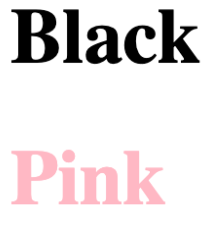

 

Why did I choose black and pink? If you know, you know. Not trying to expose myself in a README.

## Advanced Style

That's it for our little CSS recap! Now, it's time to advance-ify. First stop: style.

In order to more deeply understand style, it's worthwhile to learn about three distinct properties of the way CSS works: Cascading, Specificity, and Inheritance.

### Cascading, Specificity, and Inheritance

#### Cascading

As you already know, CSS stands for Cascading Style Sheets. But why **cascading**? What makes it so important that it's included in the name?

To understand this more clearly, let's take a look at the following example in a `style.css` file we have hypothetically created:

``` css
div {
	width: 350px;
	height: 350px;
}
div {
	background-color: blue;
}
div {
	background-color: green;
}	
```

Note: please don't actually write your CSS like this - your future coworkers will be ticked off. We do need to write it like this to demonstrate cascading, though.

So now we have given our `div`'s a width, height, and background color. However, we have given CSS two different values for background color (blue and green), so which one is going to be applied?

The answer in CSS is that it will "cascade down" and apply the rules in `style.css` **in the order they are written** - from top to bottom. CSS will first give the `div` a background color of blue, but it will later encounter the new rule to set it to green, which will override the previous selection. 

We can actually take a look behind the scenes into how CSS handles cascading in our Dev Tools console in Google Chrome, which we can open by right-clicking any spot on the browser and selecting "Inspect".

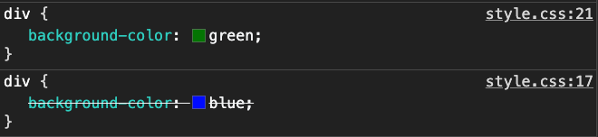

CSS has indeed removed the blue background color and overrid it with green. Awesome, now you know that I can be trusted! Let's be friends?

#### Specificity

To demonstrate specificity, let's create another hypothetical scenario in our `style.css` file:

``` css
div {
	width: 350px;
	height: 350px;
}
#green-sux {
	background-color: purple;
}
.no-purple-sux {
	background-color: blue;
}
```

This is all fine and dandy, but what if we have defined our `index.html` file as the following?

``` html
<div id=“green-sux”
     class=“no-purple-sux”>
</div>
```

Does CSS just internally combust because it doesn't know whether to apply a background color of purple or blue? No, it has a way to handle this! But that would be pretty funny to watch.

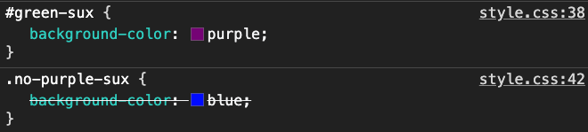

In this case, we can observe that CSS has chosen to apply a purple background-color instead of blue. For this example, the reason comes down to specificity: rules that are **more specific** will be applied over rules that are **less specific**. But what exactly do I mean by "specific"?

In CSS, there's a notion of an importance hierarchy when it comes to selectors:

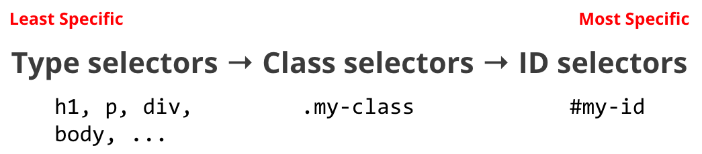

The least specific, and therefore most general, selector that you can have in CSS are **type selectors**. These encompass the base elements that are built into HTML, such as `h1`, `p`, `div`, and `body`. If a rule, such as `background-color`, is applied at the type selector level, however, it will be written over by any conflicting rule set by **class selectors**, which is any class you defined (`.no-purple-sux` in this case). Finally, any rule in the class selector will be overriden by **ID selectors** if there is conflict, because ID selectors are the most specific you can get. Because in our case, a purple background color was set with an ID, that is the one that CSS chooses in the end.

#### Inheritance

Finally, we have inheritance. If you're coming from an object-oriented programming background, this kind of inheritance isn't as big and bad. This notion of inheritance is just a direct parent-child relationship, in which most CSS rules for an element are *inherited* from their parent elements unless the child specifies otherwise. To illustrate a parent-child relationship, let's take the following example:

``` html
<p id="inheritance-p">
	That’s rough, <span>buddy</span>.
</p>
```

Note: If you've watched *Avatar: The Last Airbender* before and are wondering why I've suddenly threw in a show reference, feel free to take a look at the [slides](https://docs.google.com/presentation/d/1i2n3sUXJCIcx33DxnykCrHaLLHNIM6OdozyEzDOY_LU/edit?usp=sharing)! It's *all* ATLA references, baby.

In this relationship, the `<p>` tag is considered the *parent* element, because it contains another HTML element, the `<span>`, inside of it. Similarly, the `<span>` is referred to as the *child* element, because it is enclosed by the `<p>` tag. Just because an element is a child element of another element does not mean that it can't also be a parent element of its own. For example, if we were to change `<span>buddy</span>` to `<span><div>buddy</div></span>`, the `<span>` would now be a parent of the `<div>`, as well as the child of `<p>`. It's a whole HTML family tree!

With that established, let's add the following styles into our `style.css`:

``` css
#inheritance-p {
    color: gray;
}

#inheritance-p > span { /* this syntax refers to a span within #inheritance-p */
    font-weight: bold;
}
```

We will see the following in the browser:


Note: I've included the `font-weight: bold` line just to make it clear that the `<span>` does indeed exist as a separate entity.

Here, even though we never explicitly told the `<span>` to be gray, it implicitly *inherited* the color from its parent element, which is `#inheritance-p`. Isn't that neat?

However, let's see what happens when we add that the `<span>` should take on a text color of red:

``` css
#inheritance-p {
    color: gray;
}

#inheritance-p > span { /* this syntax refers to a span within #inheritance-p */
    font-weight: bold;
		color: red; /* new line added */
}
```

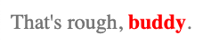

Now, the text within the `<span>` has taken on the part of the inheritance definition that mentions that styles are inherited **unless otherwise specified**, which we just did.

As a final note on inheritance, notice how I mentioned that *most* CSS rules are inherited from a parent element, not all. The following [StackOverflow post](https://stackoverflow.com/questions/5612302/which-css-properties-are-inherited) gives a full list of properties that you can cross-reference to check what properties *are* inherited. For the other properties not listed, there were reasons why they were set to not be inherited, but I won't get into them here.

Cascading, specificity, and inheritance all provide context for why CSS is making the decisions it is making. On the other hand, the rules of each intertwine with each other in ways that may make it confusing for why something is styled the way it is. In the end, though, practice makes perfect, and soon you'll become the CSS Avatar: master of cascading, specificity, and inheritance.

### Pseudo-classes

So far, we have been applying styles onto the "normal" state of an element, aka what we normally see on a webpage. However, there are also "special" states an element can have that are distinct from these normal cases, such as the state a link is in after it has been clicked/visited, or the state a button is in when it is hovered over. For these cases, we are working with **pseudo-classes**, which is a special kind of selector that allows you to directly apply style properties onto these special states.

To define styles for a pseudo-class, we use the following syntax:

``` css
selector:pseudo-class {
  property: value;
}
```

where `selector` is the selector that the pseudo-class is a part of, and  `pseudo-class` is the aforementioned special state, i.e. `hovered` or `visited`.

Here's an example for how we would change a link with ID `#pseudo-class-link` to have a hover color of pink:

``` css
#pseudo-class-link:hover {
    color: pink;
}
```

With the following HTML line:

``` html
<a id="pseudo-class-link" href="https://crouton.net/">Crouton</a>
```

We will now see the following in our browser:

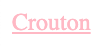

Crouton.

#### Keywords

There are certain pre-defined **keywords** for pseudo-classes that make it easy to work with multiple kinds of the same element within a parent element. For example, let's look at the following HTML file, which is a 100%, word-for-word copy of the lyrics to "Lose Yourself" by Eminem:

``` html
<div>
  <p class="pseudo-class-keyword">His palms spaghetti</p>
  <p class="pseudo-class-keyword">Knees weak, arms spaghetti</p>
  <p class="pseudo-class-keyword">There's vomit on his sweater spaghetti</p>
  <p class="pseudo-class-keyword">Mom's already</p>
</div>
```

... or at least how I remembered them.

Here, we have 4 `<p>` tags within a `<div>` parent element. If we wanted to style the first `<p>` tag, the last `<p>` tag, or any `<p>` tag individually, we could potentially do so by adding a new ID attribute to it and styling that ID. However, there is an easier way to do this same task using pseudo-classes, given that the `<p>` tags are are all members of the same parent element.

For example, if we want to change the text color of the first `<p>` to be pink, we can style the `first-child` pseudo-class:

``` css
.pseudo-class-keyword:first-child {
    color: pink;
}
```

Similarly, if we want to change the text color of the last `<p>` in the `<div>` to be red, we can use the `last-child` pseudo-class:

``` css
.pseudo-class-keyword:last-child {
    color: red;
}
```

Finally, if we want to specifically apply styles to the 3rd `<p>`, we can use the more expressive `nth-child()` pseudo-class, which takes in a number in its parentheses that corresponds to the number of the element inside a parent element, starting from 1. In our use case, this would look like:

``` css
.pseudo-class-keyword:nth-child(3) {
    color: blue;
}
```

Here's our final product:

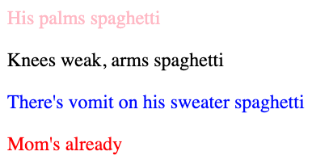

Love that song.

### Transitions

So far, we've been working with completely static styles. Well, I'm happy to report that we're  finally learning how to make our elements move! **Transitions** in particular deal with changing style properties *smoothly*, over a *duration*. Transitions define the manner in which an element will change from a *beginning state* to an *end state*.

To get some context, let's take a look at an example, where we have a `<div>` that will expand its width from `100px` to `300px` when hovered on.

``` css
div {
  width: 100px;
  height: 100px;
  background-color: red;
  transition: width 2s;
}

div:hover {
  width: 300px;
}
```

Here's what this interaction would look like in the browser:

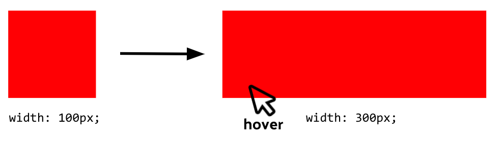

The original `<div>` here is the beginning state, the `hover` state of the `<div>` is the end state, and the action of hovering is the "trigger" that allows it to reach the `hover` state. Without transitions, the result would be an abrupt change from small to wide, with no smoothness in between the state changes. Ideally, we want to avoid this joltiness, and have a smoother transition. To do this, there are some new properties that we need to add.

``` css
div {
  width: 100px;
  height: 100px;
  background-color: red;
  transition: width 2s; /* new property */
}

div:hover {
  width: 300px;
}
```

The `transition` property is added to the element you want as your beginning state. The values that the `transition` property is looking for is the *property* that you want to transition (`width` in this case), along with the *duration* - how long the transition should take (2 seconds).

After adding this line, we should see a smooth, linear transition from the div's original state to its elongated, hovered state.

Here is a list of transition-related properties we can also set besides the base `transition` property shown. This is not the complete list, but you can find all of them in this [link](https://developer.mozilla.org/en-US/docs/Web/CSS/CSS_Transitions/Using_CSS_transitions).

- `transition-property`: the property to apply the transition on
- `transition-duration`: the time for the transition
- `transition-timing-function`: the “speed curve” of the transition
  - Sample values: `ease`, `ease-in`, `ease-out`, `ease-in-out`, `linear`
- `transition-delay`: the time to wait to start transition

Note that although `transition-property` and `transition-duration` have already been defined in the `transition` property, you can also define them separately using these individual properties. `transition` just gives a shorthand, handy way of declaring both of them in one property, and it can actually even be extended to include `transition-timing-function` and `transition-delay` in one line. The following lines, as a result, are equivalent:

``` css
div {
  width: 100px;
  height: 100px;
  background-color: red;
  transition: width 2s ease-in 4s; /* transition-property, transition-duration, 
  																	  transition-timing-function, transition-delay */
}
```

``` css
div {
  width: 100px;
  height: 100px;
  background-color: red;
  transition-property: width;
  transition-duration: 2s;
  transition-timing-function: ease-in;
  transition-delay: 4s;
}
```

### Animations

**Animations**, as the name suggests, *animates* an HTML element in a user-defined way. It lets the element change from one style to another. If you're wondering why this definition sounds strangely similar to the one for transitions, that's because transitions are a *type of* animations that only allow changes from a beginning state to an end state that is triggered by some user interaction, llike a hover. Animations, however, allows us to add more expressive and possess more fine-grained control over the movable parts on our webpage.

Here's a GIF that shows the difference between what transitions and animations are capable of (I'm hoping you read that in your mind as gif, and not jif):


#### Syntax: Keyframes

Because animations provide a wider range of capabilities, their syntax is slightly more complex. Instead of specifying a transition as just a property within the element we want to animate, we have to define a separate **keyframe** that holds all of the animation information we want to apply to some element. The following shows the syntax for a keyframe we have named `example1`, though the name can be anything we want it to be:

``` css
@keyframes example1 {
  from {background-color: red;}
  to {background-color: yellow;}
}
```

Although the syntax is different, this keyframe shows a use case that is pretty similar to what we were working with using transitions. The `from` keyword here is specifying what we want the beginning state to be, while the `to` keyword is the end state. The difference for animations, which we will see later, is that this animation does not have to be explicitly triggered and will start immediately once the page is loaded.

Here is another example of a keyframe that shows that we are not only able to have a beginning and end, but also can include intermediary steps, using percentages.

``` css
@keyframes example2 {
  0% {background-color: red;}
  25% {background-color: yellow;}
  50% {background-color: green;}
  100% {background-color: blue;}
}
```

What the `example2` keyframe is showing us is that using percentages, we can define what the element looks like *at certain stages of the animation*. For example, this says that at 0% (the start), the element should be red. 25% of the way through the animation, the color should change to yellow. Then, 50% of the way through the animation the color should change to green, and finally, at the end of the animation at 100% the background color should be blue. Once we apply this keyframe on an element, the animation will take care of the smooth transition between these background colors.

#### Syntax: Applying the Animation

Once we have defined a keyframe, we now need to *apply* it on an element so that it can be run. This part of the process is similar to adding `transition` to an element for transitions, but in this case we specify the `animation-name`, which is the name of the keyframe we want to apply, and `animation-duration`, the amount of time the animation should take.

For example, let's apply `example1` to a `<div>` that we have defined:

``` css
/* The element to apply the animation to */
div {
  width: 100px;
  height: 100px;
  background-color: red;
  animation-name: example2; /* name of animation */
  animation-duration: 4s; /* duration of animation */
}
```

Now, the div should cycle through red, yellow, green, and blue, just as we defined in the `example2` keyframe. Unfortunately, since animations don't show up in README's, you'll just have to trust me that this works. Or, feel free to try it out yourself in the [examples-demo](./examples-demo) project! There is a similar `<div>` set up to this one in the "transitions-animations" folder.

Here are some commonly used properties that help you stylize your animations. You may fine that some of these properties directly parallel one we have seen already for transitions. Here is a [link](https://developer.mozilla.org/en-US/docs/Web/CSS/CSS_Animations/Using_CSS_animations) to a more complete list of properties for animations.

- `animation-name`: the name of the keyframe to use for animations
- `animation-duration`: the time for the animation
- `animation-timing-function`: the “speed curve” of the transition
  - Sample values: `ease`, `ease-in`, `ease-out`, `ease-in-out`, `linear`
- `animation-delay`: the time to wait to start transition
- `animation-iteration-count`: the number of times the animation will run
  - Sample values: Either a number for the number of times, or `infinite`, which means it will run indefinitely. 
- `animation-direction`: the direction the animation will run
  - Sample values: `normal`, `reverse`, `alternate`

`animation-iteration-count` is the number of times we want the animation to run. 

As a final note, animations are capable of much more than changing background colors at different points. You can create really cool, custom functions that a really sophisticated website will have. That, unfortunately, is above my pay-grade, but you can explore for yourself how you're able to accomplish that with CSS animation guides like [this](https://developer.mozilla.org/en-US/docs/Web/CSS/CSS_Animations/Using_CSS_animations)!

## Layout

For the most part, we have only been working with the style of each individual element. As a web developer, however, there will inevitably come a time where you will have to work with how these elements are laid out with respect to each other on a web page. This section is dedicated to two layout tools: **Flexbox** and **Grid**. We will first take a look at why you may choose to use them, and then we'll take a look at each of them individually.

### Why Use Flexbox or Grid?

In order to understand the motivation behind using either Flexbox or Grid, we should first mention the way developers had to lay things out before them: the Jurassic era.

Prior to Flexbox and Grid, if a developer wanted to get an element in the position they wanted, they had to use properties that included *floats* and *positions*. I will leave the details about these properties as an exercise to the reader, but the gist of it is that they were a very "hack-y" way of going about layout. Some layout requirements that seemed like a basic necessity, like vertically centering an element, or making child elements take an equal amount of width and height within a container, takes a lot of roundabout coding to get just right. Furthermore, these layouts were rigid, and they couldn't adapt to different screen sizes seamlessly. All in all, it was pretty painful.

When Flexbox and Grid came to popularity, their accessible interface helped address a lot of these layout grievances. For one, both are tools used for adaptive layout. With both, there is a notion of a parent container, and using these containers, you can flexibly deal with all child elements and how they are laid out within the container. Flexbox and Grid are two different solutions to the same problem, but they do have some distinct differences. For one, Flexbox is 1-dimensional, meaning we only deal with the layout of a row or column at once time. On the other hand, Grid is 2-dimensional, which means that *both* row and column are considered in layout.

### Flexbox

We will first take a look at **Flexbox**, which deals with layout in *1 dimension* (row or column). In Flexbox, child elements, or *flex items*, can be laid out in any direction or orientation, can "flex" their sizes according to remaining space within a container, and be easily vertically/horizontally aligned. In order to truly understand Flexbox, it's time to introduce someone. Everyone, meet *Flexbox-chan*.


#### Using Flexbox

In order to incorporate Flexbox into a container, you must add `display: flex;` on the *parent container* of whatever you want to lay out the child items of.

``` css
.flex-container {
	... /* other styles */
	display: flex;
}
```

Once we add this line, we will see an automatic change to Flexbox-chan:


When `display: flex;` is added, not only is the layout set to Flexbox, but the flex items will also be automatically set in row direction, because that is the default in Flexbox.

#### Flex Direction

In Flexbox, we can immediately change the direction in which the flex items are laid out in using `flex-direction`. The following are the directional values that `flex-direction` can take:

- `row`: left to right (default)
- `row-reverse`: right to left
- `column`: top to bottom
- `column-reverse`: bottom to top

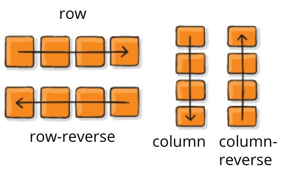

#### Flex Axes

Flexbox possesses many features for alignment, but to understand them, we must first take a detour to understand how the main axis and cross axis work. The **main axis** is an invisible axis that goes *along* the direction of the flex direction. For example, if the `flex-direction` is set to `row` or `row-reverse`, the main axis would go horizontally, and similarly vertically for `column` or `column-reverse`. The **cross axis**, on the other hand, goes *perpendicular* to the direction of `flex-direction`. For `row` and `row-reverse`, this would be vertical, and for `column` and `column-reverse`, this would go horizontally.

#### Justifying Content

Now that we have established the axes, we can first dive into `justify-content`, which aligns the flex items within a container *along the main axis*. For `row` and `row-reverse`, this would deal with left/right position, and top/bottom position for `column` and `column-reverse`. The following properties are some of the many values that `justify-content` can take on:

- `flex-start`: items are packed at the start of the main axis
- `flex-end`: items are packed at the end of the main axis
- `center`: items are aligned at the center of the main axis
- `space-between`: items are evenly distributed in the line; first item is on the start line, last item is on the end line
- `space-around`: items are evenly distributed in the line with equal space around them


#### Align Items

Perpendicular to justifying content is `align-items` , which aligns flex items *along the cross axis*. For `row` and `row-reverse`, this would deal with top/bottom position, and left/right position for `column` and `column-reverse`. The following properties are some of the many values that `align-items` can take on:

- `flex-start`: items are packed at the start of the cross axis
- `flex-end`: items are packed at the end of the cross axis
- `center`: items are aligned at the center of the cross axis
- `stretch`: items take up all of the available space of the cross axis in the container

For more on all of the properties I covered above, along with many, *many* others, here is a [helpful guide](https://css-tricks.com/snippets/css/a-guide-to-flexbox/) to Flexbox that goes much more in depth.

### Grid

Grid is another layout tool used to efficiently handle adaptive layouts, this time in *2 dimensions*! (hold for applause) What this means is that unlike Flexbox, where we only work with a row or column at a time, we now work with *both* row and column at the same time. Given a parent element (*grid container*), we can specify a particular row and column our item (*grid item*) should be placed with, along with how many rows and columns it should span for. In order to understand Grid, let's all give a warm welcome to *Grid-kun*.

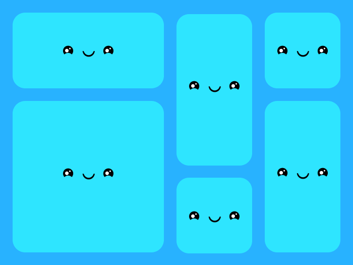

Actually, that's probably the last time you'll see Grid-kun. It took me a while to design, though, so I hope you appreciate the effort.

#### Using Grid

In order to use Grid, we add `display-grid` to the container in which we want to lay out the child elements in a grid.

``` css
.grid-container {
	… /* other styles */
	display: grid;
}
```

On its own, adding this line will not do much, besides enabling Grid for this container. In order to actively lay out items, we have to do some additional steps, such as *defining a grid template*.

#### Defining a Grid Template

To define a grid template, we use `grid-template-columns` to mark how many columns we want our grid to take. For example, if we write 4 different size values separated by spaces, we are saying we want a grid with 4 columns. Similarly, adding 3 size values separated by spaces to `grid-template-rows` will create 3 rows in the grid.

The values passed into `grid-template-columns` and `grid-template-rows` can take numerous forms. For one, we can give the column/row a fixed size using pixels (i.e. `25px`). Alternatively, we can write a % of the grid container we want the column/row to take (i.e. `50%`). Finally, we can use the special keyword `auto` to mark that the column should just take the remaning space not taken by other columns/rows.

Here is an example of all of these values being used to define a grid template with 5 columns and 3 rows:

``` css
.grid-container {
	… /* other styles */
	display: grid;
	grid-template-columns: 40px 50px auto 50px 40px;
	grid-template-rows: 25% 100px auto;
}
```

Result:

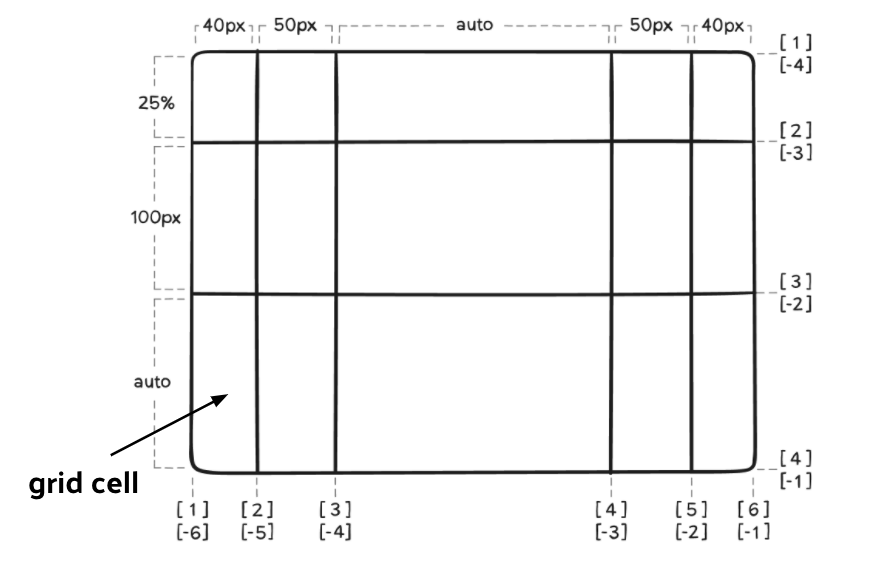

In a grid, each row-column pair forms a square, which we refer to as a **grid cell**.

#### Justify/Align Items

In grid, you can also deal with how items in the grid are laid out *within their grid cell*. Using `justify-items`, you are able to align the grid items along the **row axis**, and with `align-items`, you can align the grid items along the **column axis**. Below is an example of how `justify-items` and `align-items` are used, both being passed the `start` value.

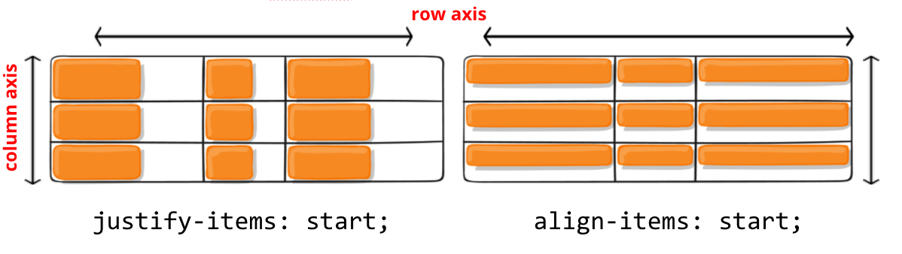

The following are some commonly used values for `justify-items` and `align-items` for Grid:

- `start`: aligns content in grid item at the start of row (justify) or column (align) axis
- `end`: aligns content in grid item at the end of row (justify) or column (align) axis
- `center`: aligns content in grid item at the center of row (justify) or column (align) axis
- `stretch`: stretches content fully in the row (justify) or column (align) axis

#### Justify/Align Content

As opposed to working with individual grid items, `justify-content` and `align-content` work with alignment of the grid *itself* within the grid container. The former aligns the grid along the **row axis**, while the latter aligns it on the **column axis**.

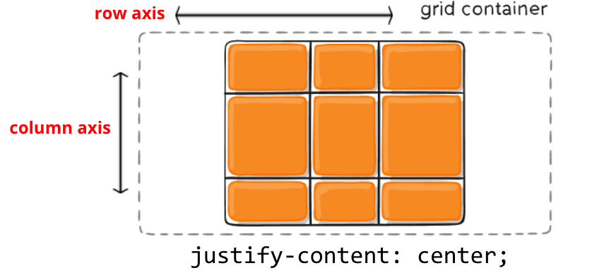

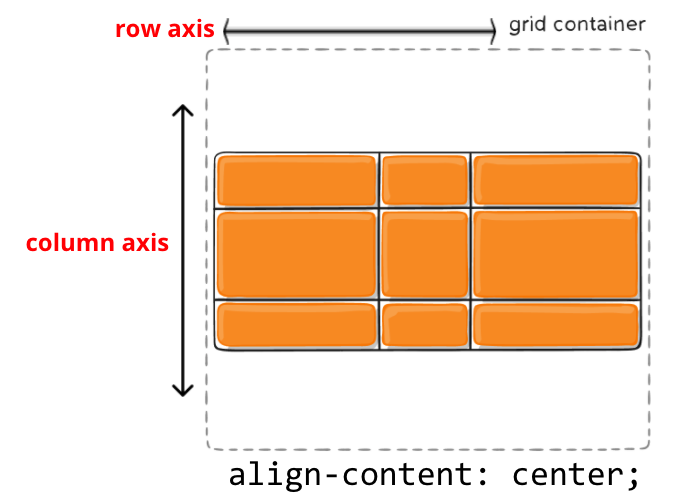

The following are some commonly used values for `justify-items` and `align-items` for Grid:

- `start`: aligns grid in container at the start of row (justify) or column (align) axis
- `end`: aligns grid in container at the end of row (justify) or column (align) axis
- `center`: aligns grid in container at the center of row (justify) or column (align) axis
- `stretch`: stretches grid fully in the row (justify) or column (align) axis
- `space-around`: columns (justify) or rows (align) are evenly distributed with equal space around them
- `space-between`: columns (justify) or rows (align) are evenly distributed in the line; first item is on the start line, last item is on the end line

For more on all of the properties I covered above, along with many, *many* others, here is a [helpful guide](https://css-tricks.com/snippets/css/complete-guide-grid/) to Grid that goes much more in depth.

#### Sneak Peak

In this workshop, I have only given a peek at the *surface* of what Grid is capable of. Although I will not cover additional properties, I will demonstrate a real-world example of the power of Grid.

Here is an image of a page on the Daily Bruin website, UCLA's independent, student-run newspaper:

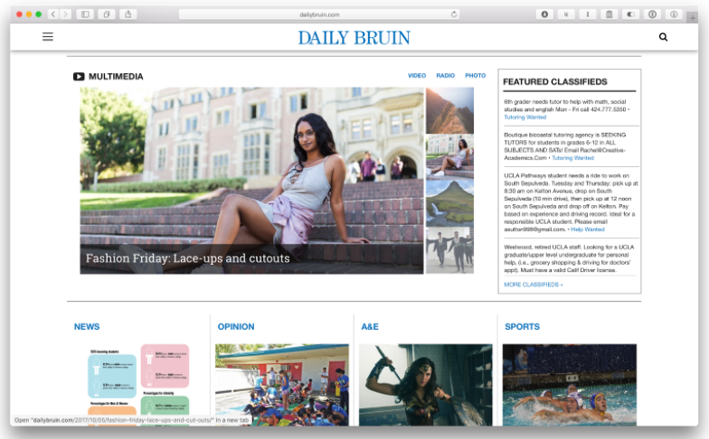

Although it doesn't look like it now, this page was actually created using Grid! It might be more clear if we divide the page into columns:

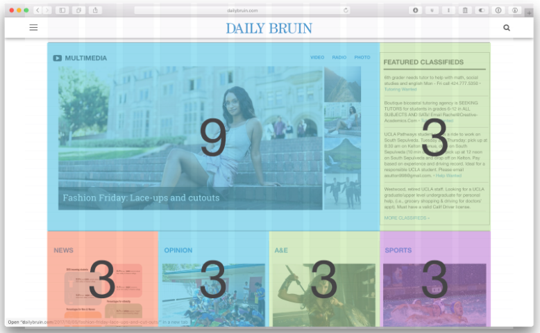

Neat! In this example, we can see that the grid items take on multiple columns and rows. Although I did not demonstrate this functionality here, it is a key component of Grid that you should definitely look more into if you're interested. Using Grid, we're able to make extremely concise, adaptive layouts that are able to respond to different situations, such as different screen sizes.

### Summary and Resources

That was a long journey into layout! One question you may be dying to ask is, "Should I learn how to use Flexbox or Grid?" The biggest difference as we have mentioned before is that Flexbox is 1-dimensional, while Grid is 2-dimensional. Along with this distinction comes the fact that although Grid can do many powerful things, it may be more complex and difficult to understand, so Flexbox may be an easier place to start (though this is a matter of opinion). Another thing is that some projects may end up using both layout systems to create really adaptive layouts. Because of this, the best answer I can give is "yes" (in other words, you'll benefit from learning both).

With that, the last thing I'll leave you with a couple of helpful resources on both Flexbox and Grid. The first two are full guides on each, and the next two are good ways to practice and solidify your fundamental grasp of each layout tool.

**Guides**

- Flexbox: https://css-tricks.com/snippets/css/a-guide-to-flexbox/
- Grid: https://css-tricks.com/snippets/css/complete-guide-grid/

**Practice**

- Flexbox Froggy: https://flexboxfroggy.com/
- Grid Garden: https://cssgridgarden.com/

Congrats on making to the end of the README! If you would like to see a completed version of examples we worked on during the real workshop, feel free to visit [examples-completed](,examples-completed).

