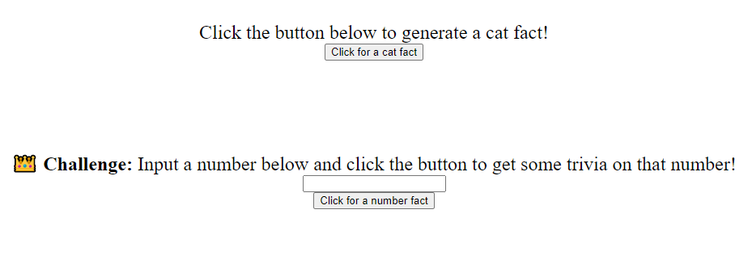
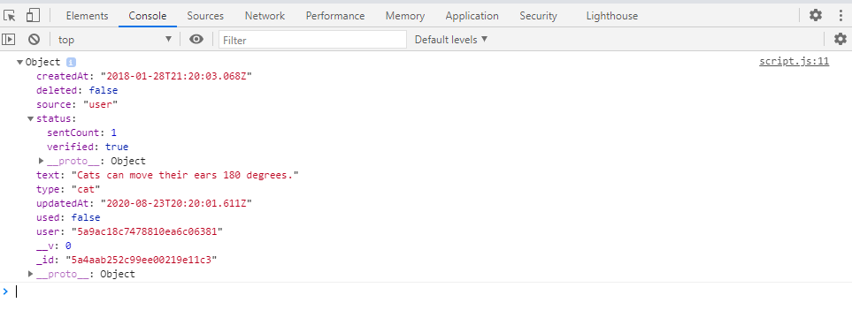

# Hackschool Session 5: Asynchronous Programming and Web APIs

**Date**: November 11, 2020

**Location**: Zoom

**Teacher**: Alex Xia ([@khxia](https://github.com/khxia))


## Resources

- [Slides](https://tinyurl.com/hackschool20-s5-slides) 
- [ACM Membership Attendance Portal](http://members.uclaacm.com/login)


## What we'll be learning today

+ [What is Async?](#what-is-async)
    + [Introducing callbacks](#Introducing-callbacks)
    + [One problem with callbacks](#one-problem-with-callbacks)
+ [What are Promises?](#what-are-promises)
+ [Extra Reading: async/await keywords](#extra-reading-asyncawait-keywords)
+ [Quick rundown on web APIs](#quick-rundown-on-web-apis)
    + [JSON vs JavaScript Objects](#json-vs-javascript-objects)
    + [fetch() function](#fetch-function)
+ [Demo time!](#demo-time)
+ [💪 Challenge](#️--challenge)


## What is Async?

Normally, our programs run synchronously. Synchronous means that, if we run two tasks, the second task must wait for the first one to complete before running. No cuts, no buts, no coconuts!

<div align=center>
    
</div>

As an analogy, let's say you needed to wash your clothes, dry your clothes, but also do homework at the same time. You wouldn't want to do each task one at a time because it is slower. That would be a waste of time. Normally, you would:

1. Put your clothes in the washing machine
2. Start doing homework
3. After your clothes have washed, stop doing homework and put the washed clothes in the dryer
4. Resume doing homework
5. After your clothes have dried, stop doing homework, take them out of the dryer and fold them.
6. Continue doing your homework late into the night. Damn these professors.

Hence, we see that if we do these things **asynchronously**, we become more efficient.

Asynchronous programming helps us to make our code faster. When we build a website, we will be: talking to the database, downloading something, reading from files, requesting data from websites etc. 
These things do not happen very fast. It takes time - it happens asynchronously. The value that we expect from these operations is not returned right away. So instead we would like to be able to do 
other things while we wait for these operations to complete. And when they do return a value, we should be able to know exactly what to do with that value. 

Sounds pretty complicated huh? Let's use cooking as another analogy.

<div align=center>
    
</div>

So unlike in Genshin Impact, cooking in real-life is a little more complicated. Let's take my best dish - 🍜 instant vegetable ramen (*sad*), as an example.

First, we want to boil the water. Let's say that this takes 3 seconds.

```js
const boilWater = () => {
    console.log('Start boiling!'); 
    const start = Date.now();            // Get a reference of the current time
    while (Date.now() < start + 3000) {} // continuosly checks if 3000 milliseconds has passed.
    console.log('Water boiled!');
};
```

We are making vegetable ramen, so obviously we need some veggies! Let's say that washing the vegetables takes 2 seconds.

```js
const washVeggies = () => {
    console.log('Start washing!');
    const start = Date.now();            // Get a reference of the current time.
    while (Date.now() < start + 2000) {} // continuosly checks if 2000 milliseconds has passed.
    console.log('Veggies washed!');
};
```

Now, let's write functions to add our veggies and ramen.

```js
const addVeggies = () => {
    console.log('Veggies in da pan~');
};
```

```js
const addRamen = () => {
    console.log('Ramen in da wata~');
};
```

So if we call these functions:

```js
boilWater(); //3s
addRamen(); //instant
washVeggies(); //2s
addVeggies(); //instant

//Start boiling!
//Water boiled!
//Ramen in da wata~
//Start washing!
//Veggies washed!
//Veggies in da pan~
```

### Introducing callbacks

Ok, this is going to take a total of 5 seconds, but really, did it have to take that long?

Are you going to wait for your water to boil before you start washing your veggies?

No! We don't need to stare at our water boiling! As engineers and cooks, we're all about efficiency here.

What we want to do is start boiling the water, and while the water is boiling, we start washing the veggies. This can be achieved using callback functions.

**What are callback functions?**

A callback function is a function passed into another function as an argument, which is then invoked inside the outer function.

An example would be:

```js
const sayHello = (name) => {
    console.log("Hello: " + name);
};

const greetUser = (callback) => {
    var username = "Alex";
    callback(username);
};

greetUser(sayHello);
```

Although the above code is an example of a **synchronous callback**, since everything is executed immediately, callbacks are often used to continue executing code after an asynchronous operation has completed. Using a function called `setTimeout`, let's try to wash the veggies while the water is boiling. 


```js
const boilWater = () => {
    console.log('Start boiling!');
    setTimeout( () => {              // define a callback function that just console.log()'s a message
        console.log('Water boiled!');
    }, 3000);                        // use 3000 millieconds to specify that we want to call the function 
};                              // defined above after 3 seconds. 
```

`setTimeout` takes two arguments: a function called a **callback function** and the number of milliseconds. Unlike our previous implementation, 
we don't sit and stare at the water until it's boiled. Rather, we set a timer to remind us to come back and are free to do other things. 
After 3000 milliseconds, we execute the function we passed in. Note that when we pass in a function like this, the function is called a callback.

Similarily, we can do the same for our `washVeggies()` function to have the same callback.

```js
const washVeggies = () => {
    console.log('Start washing!');
    setTimeout( () => {              // define a callback function that just console.log()'s a message
        console.log('Veggies washed!');
    }, 2000);                        // use 2000 millieconds to specify that we want to call the function 
};                                   // defined above after 2 seconds. 
```

### One problem with callbacks

Looking cool, Joker! Now we can wash our veggies as we boil our water:

```js
boilWater();
washVeggies();

//Start boiling!
//Start washing!
//Veggies washed!
//Water boiled!
```

But what do you think will happen if we do this?

```js
boilWater();
washVeggies();
addRamen();
addVeggies();
```

Oh no, we have put in the our ramen and veggies into the pot before the water has boiled. A cooking catastrophe! **You have screwed up the ramen you stupid programmer and I am very angry**.
This is analogous to doing something with the data we get from the server before the data actually comes in. This is still solvable using callbacks.

```js
const boilWater = () => {
    console.log('Start boiling!');
    setTimeout( () => {              
        console.log('Water boiled!');
        addRamen();
        addVeggies();
    }, 3000);                        
};                      
```

There we go! All we did was call the `addRamen()` and `addVeggies()` functions inside of the callback for `boilWater`, ensuring that we will 
only add the ramen and veggies after the water has boiled.

Now, if we call:

```js
boilWater();
washVeggies();

//Start boiling!
//Start washing!
//Veggies washed!
//Water boiled!
//Ramen in da wata~
//Veggies in da pan~
```

Now, this code will only take 3 seconds to run. Congrats! 

However, we begin to notice a problem: Our code is getting complicated. What if we needed to call a callback within a callback? And then another callback within that callback?
Our code will get complicated real fast. For example's sake, lets say that after the water has boiled, we need to set aside some boiled water for our soup, which takes 2 seconds (*that shit is hot*), 
then we need to add our condiments to the soup, which takes 1 second. Our code may look something like this:

```js
const boilWater = () => {
    console.log('Start boiling!');
    setTimeout( () => {              
        console.log('Water boiled!');
        console.log('Start adding boiled water to bowl!');
        setTimeout( () => {
            console.log('Finished adding boiled water!');
            console.log('Start adding condiments!');
            setTimeout( () => {
                console.log('Finished adding condiments!')
            }, 1000);
        }, 2000);
        addRamen();
        addVeggies();
    }, 3000);                        
};     
```

Ew! So complicated! Haiya! Uncle Roger don't approve. When you nest so many callbacks together, this is called **callback hell** because not only is your
code hard to read, but it is also very hard to debug and catch bugs. These problems are fixable with `promises`.

> Learn more about callback hell [here](http://callbackhell.com/).

## What are Promises?

A Promise is an object that "represents the eventual completion (or failure) of an asynchronous operation, and its resulting value." (from MDN)

It can be one of three states:
- Pending
- Fulfilled
- Rejected

Promises have a method called `.then()` . It takes a function as an argument. JavaScript will call this function whenever a Promise has reached its "fulfilled" state. 

Similarly, Promises have another method called `.catch()`. It takes a function as its argument. JavaScript will call this function whenever a Promise has reached its “rejected” state

The key point here is that promises offer a way to guarantee that data will be there before we do anything further. The next part is about how to create a Promise.
We will mostly be using promises instead of creating them, but please read if you're interested.

```js
const promise = new Promise((resolve, reject) => {
    if (1 < 2) {
      resolve('Success!');
    }
    else {
      reject('Failed :(');
    }
});

const doOnSuccess = (successMessage) => {
    console.log(successMessage);
};
const doOnFailure = (failureMessage) => {
    console.log(failureMessage);
}; 

promise.then(doOnSuccess).catch(doOnFailure);
```

When you create a new `Promise`, you pass in a function. This function has two parameters, usually named `resolve` and `reject`. 
You call resolve when you want to return a value. In this case, we call resolve when the condition `1 < 2` is true (this is always true). 
`resolve` takes one parameter, which is the value you want to return.

More common, you can also put the function in `.then()` without naming it.

```js
promise.then((successMessage) => {
    console.log(successMessage);
}.catch((failureMessage) => {
    console.log(failureMessage);
});
```

Let's apply this to our 🍜 ramen problem:

```js
const boilWater = () => {
    console.log('Start boiling!');
    return new Promise((resolve, reject) => {
        setTimeout(() => {
            console.log('Water boiled!');
            resolve();
        }, 3000);
    });
};

boilWater().then(() => {
    // do soup and condiments stuff here
    addRamen();
    addVeggies();
});
```

`boilWater` returns a `Promise` that resolves after 3 seconds. Since `addRamen()` is called inside of `.then()`, it will only happen after the `Promise` is resolved. 
So you will always add the Ramen and Veggies after the water has been boiled AND your code looks clean. 

Well done! You have made Naruto happy. Itadakimasu! 🍜

<div align=center>
    
</div>

> If you want, you can read more about why we prefer promises over callbacks [here](https://medium.com/better-programming/callbacks-vs-promises-in-javascript-1f074e93a3b5#:~:text=A%20key%20difference%20between%20the,on%20the%20returned%20promise%20object.)

> 🚩 Checkpoint: That's it for the theory! You should have a basic understanding of how async works.
> Next, we will introduce an application of async and how you can incorporate them into your websites!

## Extra Reading: async/await keywords

I know, extra readings suck. But there are two keywords (`async` and `await`) that make your code look a lot cleaner.

You use `async` when you declare a function. It means that the function will return a `Promise`. Even if you don't explicitly return a `Promise`, an async function will return a `Promise`.

```js
const f = async () => {
    return 1;
};

f().then((result) => {
    console.log(result); // should log 1
});
```

In an `async` function, you can use `await` before a promise. This pauses the execution of the `async` function and waits for the passed `Promise`'s resolution, and then resumes the `async` function's execution. The program can do other things during this time.

**Important!** You can only use `await` inside of an `async` function.

```js
const f = async () => {
    return 1; //implicitly a promise because of async
};

const main = async () => {
    let result = await f(); // waits until result is filled before moving on
    console.log(result);
};

main();
```

With `await`, we don't need to nest a bunch of `.then()`'s. This is another way to call the 🍜 ramen functions so that we will add the ramen after we boil the water.

```js
const main = async () => {
    await boilWater();
    addRamen();
    await washVeggies();
    addVeggies();
};

main();

//Start boiling!
//Water boiled!
//Ramen in da wata~
//Start washing!
//Veggies washed!
//Veggies in da pan~
```
If we run this, you might notice that it still takes 5 seconds to complete. How can we run `boilWater()` and `washVeggies()` in parallel? 
We can push the two returned promises onto an array and then use `Promise.all()`:

```js
const main = async () => {
    const allPromises = [];
    allPromises.push(boilWater());
    allPromises.push(washVeggies());
    await Promise.all(allPromises);
    addRamen();
    addVeggies();
};
```

Let's boil 5 pots of water at a time!

```js
const main = async () => {
    const allPromises = [];
    for (let i = 0; i < 5; i++) {
        allPromises.push(boilWater());
    }
    await Promise.all(allPromises);
    console.log('Done!')
};
```

## Quick rundown on web APIs

API stands for Application Programming Interface. An API is a definition of methods of communication among various components.
It is pretty abstract but don't worry. As you get more and more experienced, you'll gain an intuition for what an API is.

Let's use a car as an analogy:
We don't need to know how a car works to drive a car. All we need to know is how to use the ignition key, how to use the shift stick, how to use the steering wheel, and how to read the dashboard. We don't need to know how a steering wheel turns the axle, nor do we need to know how the engine makes our car move. This is like an API. Users only need to know how to use it, they don't need to know how it is actually implemented.

In the web context, an API usually refers to a set of specific URLs that we can call to retrieve some data.
So what we mean when say that we want to use a web API is essentially: we want to use code that other people have written and we do 
this by using the APIs that they have written - we use these APIs by invoking special JavaScript methods that can asynchronously grab the data that we want from the internet.

What is important to understand is the difference between JSON and JavaScript Objects.

### JSON vs JavaScript Objects

In our second workshop, we introduced the idea of a Javscript Object. Looks a little like this:

```js
const eugeneFanboy = {
    firstName: "Alex",
    lastName: "Xia",
    fanStatus: "Is a subscriber of his youtube channel: https://www.youtube.com/channel/UCs3ldykYHkVDVtM-f1Nvkjg",
    fanboying: () => {
        console.log("UwU Eugene is my number1");
    }
}
```

And then we can access an element inside of our Object by doing this:

```js
console.log(eugeneFanboy.firstName);
eugeneFanboy.fanboying();

//Alex
//UwU Eugene is my number1
```

However, when we request data from an API, it usually comes back to us in a format called JSON. Which stands for JavaScript Object Notation, 
but is **not** the same thing as a JavaScript Object.

Let's take an example, enter this URL in your browser: 

```txt
https://cat-fact.herokuapp.com/facts/random
```
Congratulations! You have used a web API! You may have noticed that the output looks something like this:

```json
{
    "used": false,
    "source": "api",
    "type": "cat",
    "deleted": false,
    "_id": "591f97bcccb34a14d3f7dc96",
    "__v": 0,
    "text": "Cats' hearing stops at 65 khz (kilohertz); humans' hearing stops at 20 khz.",
    "updatedAt": "2020-08-23T20:20:01.611Z","createdAt":"2018-01-04T01:10:54.673Z",
    "status": {
        "verified":true,
        "sentCount":1
    },
    "user": "5a9ac18c7478810ea6c06381"
}
```

You may have also noticed that one difference that JSON has from a JavaScript object is that in JSON, the `keys` are in quotes.
There are other differences between the two. The biggest difference is that while JSON values can only be one of the six datatypes (strings, numbers, objects, arrays, Boolean, null). 
JavaScript values on the other hand can be any valid JavaScript Structure. In our `eugeneFanboy` example above, I defined a 
function as a value - something that cannot be done in JSON.

Essentially, because most APIs return data to us in the form of JSON, we need to do special steps to convert them into JavaScript Objects.
We will talk about this later.

> Still confused? No problem. This [short article](https://medium.com/techtrument/javascript-object-vs-json-117965ea3dea#:~:text=The%20JSON%20values%20can%20only,be%20any%20valid%20JavaScript%20Structure.&text=Unlike%20JavaScript%20Object%2C%20a%20JSON,and%20then%20parsed%20into%20JavaScript) 
> can give you a little more insight on the differences between JSON and JavaScript Objects.

### fetch() function

Previously, we entered `https://cat-fact.herokuapp.com/facts/random` in our browser and got the data that we wanted. The question now becomes: "How do we get our JavaScript code to do this?".

The `fetch()` function is a predefined function that we can use, that provides an easy, logical way to fetch resources asynchronously across the internet or a network. 
If you have used `Ajax` before using `XMLHttpRequest` (don't worry if you don't know these terms), think of `fetch()` as a newer and improved version.

`fetch()` takes in one argument (our URL), and it returns a `Promise` that resolves into the response that we requested, whether it is successfull or not.
Hence, we might expect our usage to look something like this:

```js
fetch('https://cat-fact.herokuapp.com/facts/random')  //Calling our fetch function which will return a promise to resolve into a JSON object
	.then( (response) => response.json())             //Call .json() on this JSON object which will return a promise to resolve into a JavaScript object
	.then( (resJson) => {                            //resJson is now our JavaScript Object and we can do whatever the hell we want with it!
		console.log(resJson);                        // Prints out the entire JavaScript Object                     
	});
```
How cool is that, we just chained two `Promises` together 😎. Let's break it down. First of all, `fetch()` goes to our URL, and succesfully resolves
our promise into a JSON object. This JSON object is stored in the variable `response`. We then call the method `.json()` on this `response`. The `.json()`
method parses the JSON object and returns a promise that will resolve into a JavaScript Object if it is successful. This JavaScript Object will then 
be stored in `resJson`. We can then use `resJson` however we like. 


## Demo time!

Cool! Why don't we see this API be used in an actual website!

I will be basing this demo off of some starter code. If you would like to follow along, feel free to paste the code in [demo-starter](./demo-starter), 
or you can download the zip files [here](./demo-starter.zip). If you just want to kick back and absorb the information, that is totally cool! You can use the [finished product](./demo-finished) of the demo as reference while you watch. 

The demo contains an HTML file, CSS file, and a script.js with content which you should be familiar with by now! Opening up your HTML file on your browser, it should look something like this:

<div align=center>
    
</div>

The challenge part is for later. For now, we just want to focus on the `get cat fact` functionality.

Go to the `script.js` file. You will see that the necessary `querySelectors` have been defined:

```js
const catfact = document.querySelector('#cat-fact');
const catbtn = document.querySelector('#cat-btn');
```
and the necessary event listeners have been defined. Notice that with our knowledge that we gained in this workshop, we can realize that the second argument of `addEventListener()` is actually a callback function.
JavaScript will call the function `getCatFactFromAPI()` if it detects that `catbtn` has been clicked.
```js
catbtn.addEventListener("click", getCatFactFromAPI);
```

Now all we need to do is implement `getCatFactFromAPI()`. 

We actually have a pretty solid foundation from our [fetch section](#fetch()-function). If we copy and paste it over, it looks something like this:

```js
const getCatFactFromAPI = () => {
	fetch('https://cat-fact.herokuapp.com/facts/random')
	.then( (response) => response.json())
	.then( (resJson) => {
		console.log(resJson);
	});
};
```

However, we're still not quite there yet. What we're looking for is a *kawaii* cat fact 😸, not a JavaScript Object (ew not cute). 
That being said, we did `console.log(resJson);`. Let's see what it outputs.

<div align=center>
    
</div>

Hmm. It seems that what we need is the `text` attribute of our `resJson` object. Since we also know that we have defined a variable `catfact` to display our cat fact, we can add the line:

```js
catfact.innerHTML = resJson.text;
```

> Note: we covered `.innerHTML` in workshop 3. 

Perfect! Add some error catching and our final product should look like this:

```js
const getCatFactFromAPI = () => {
	fetch('https://cat-fact.herokuapp.com/facts/random')
	.then( (response) => response.json())
	.then( (resJson) => {
		console.log(resJson);
		catfact.innerHTML = resJson.text;
	})
	.catch( (err) => {
		console.log(err);
	});
};
```

> 🚩 Checkpoint: Pressing the button should display a random cat fact under the button.

### 💪 Challenge


