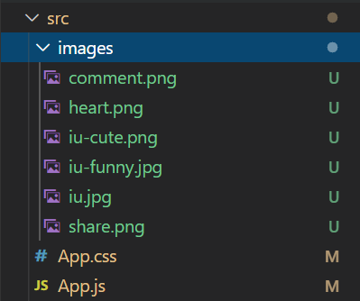

# Hackschool Session 7: Introduction to React.js

**Date**: November 25, 2020

**Location**: Zoom

**Teachers**: Eugene Lo, Jody Lin

## Resources

- [Slides](TODO)
- [ACM Membership Attendance Portal](http://members.uclaacm.com/login)

## What we'll be learning today

- [Props](#what-are-props?)
- [State](#state)

---

---

By now, we have learned how to create resuable function 
components with React! Unfortunately, all of our components
are the exact same. This is a little boring because we don't
really want to stare at a bunch of posts with the same photo
of Jungkook. How do I _customize_ each component to have
a different images, caption, and account name? In other words:

**Question:** _How we do customize each component to contain 
different information?_ (TODO: i'm not a fan of how this
question is phrased.)

**Answer:** We use props!

## What are Props?
Every function component we define has a (not-so) secret
parameter that let's us pass information to the component
each time we use it. This parameter is called the `props`
parameter. 

```jsx
function Profile(props) {
    // component code here
    ...
}
```

We pass data to this `props` parameter like this.
```html
<Profile name='jieun' age={27}/>
```

In this example, the prop called `name` and `age` each
are a single prop. The `props` parameter in our function
will contain an _object_ that contains _both_ of them. It would
look something like this:

```js
props: {
    name: 'jieun',
    age: 27
}
```

Within our function we could access these prop values the
same way we would access any javascript object value!

```js
function Profile(props) {
    console.log(props.name);
    console.log(props.age);
    // more component code here
    ...
}
```
If we ran the page containing this component in the browswer, 
we'd see the following output in the console:
```
jieun
27
```

### Careful! A _gotcha_ to look out for
Often times we will be using our prop data within html 
elements. For example 

```js
function Profile(props) {
    return <p>My name is props.name and I'm props.age years old </p>
}
```

But when you render this in your browser, you'll get this
rather disappointing component:


This is because `props.name` and `props.age` are being read
as literal text. To fix this, we just add some curly bois 
`{}`. 

```js
function Profile(props) {
    return <p>My name is {props.name} and I'm {props.age} years old </p>
}
```

By adding the `{}` around our variables, we indicate that this
chunk of text is meant to be intepreted as JSX, not literal 
text. 

After this fix, the prop renders as intended:


## Adding `props` to the InstaPost component
Let's add props to the InstaPost component we made earlier.

Here are the parts of the post we do not want hardcoded.
* account name
* image
* caption

Let's pass in some props so that our prop object will look 
something like this:
```
props: {
    accountName: 'the account name',
    image: /* the image here */,
    caption: 'some caption here'
}
```

```html
function InstaPost(props) {
    return <div className='post'>
        <div className='account-line'>
            {/* Access account name prop here*/}
            <strong>{props.accountName}</strong>
        </div>
        <div className='img-wrapper'>
            {/* Access image prop here*/}
            
        </div>
        <div className='post-info'>
            <div className='icons'>
                {/* ... */}
            </div>
            <div>
                Liked by <span>0</span> people
            </div>
            <div>
                {/* Access account name and caption here */}
                <strong>{props.accountName}</strong> {props.caption}
            </div>
        </div>
    </div>
}
```

Now download some images we'd like to use in our posts and 
save them to use later!



Back in App.js, we can now add multiple posts with 
unique data.
```html
import './App.css';
import InstaPost from './InstaPost';

/* import images we want to use*/
import iuWithBun from './images/iu.jpg';
import iuCute from './images/iu-cute.png';
import iuFunny from './images/iu-funny.jpg';

function App() {
  return (
    <div className="App">
        <InstaPost 
            accountName='jowody_lin' 
            image={iuWithBun} 
            caption='i wanna be the bun she is holding.'
        />
        <InstaPost
            accountName='not_jody8'
            image={iuCute}
            caption='why is she literally so perfect'
        />
        <InstaPost 
            accountName='defNotJody719'
            image={iuFunny}
            caption='<3 <3 <3'
        />
    </div>
  );
}
```
When we run our react app, we can see that each InstaPost
component now uses its own unique prop values!


### But can we simplify our code _even more_??? Yes!

Recall how we can use the `.map()` function to run
a for loop on an array. Rather than writing out 
the `InstaPost` component 3 times to put in prop
values, let's store our prop values in an object array.

```js
const posts = [
  {
    accountName: 'jowody_lin',
    image: iuWithBun,
    caption: 'i wanna be the bun she is holding.'
  },
  {
    accountName: 'not_jody8',
    image: iuCute,
    caption: 'why is she literally so perfect'
  },
  {
    accountName: 'defNotJody719',
    image: iuFunny,
    caption: '<3 <3 <3'
  }
]
```

Then let's use `.map()` to iterate through these objects
and apply the props to `InstaPost` components.

```js
import './App.css';
import InstaPost from './InstaPost';
import iuWithBun from './images/iu.jpg';
import iuCute from './images/iu-cute.png';
import iuFunny from './images/iu-funny.jpg';

const posts = [
  {
    accountName: 'jowody_lin',
    image: iuWithBun,
    caption: 'i wanna be the bun she is holding.'
  },
  {
    accountName: 'not_jody8',
    image: iuCute,
    caption: 'why is she literally so perfect'
  },
  {
    accountName: 'defNotJody719',
    image: iuFunny,
    caption: '<3 <3 <3'
  }
];

function App() {
  return (
    <div className="App">
      {
        posts.map(post => 
          <InstaPost 
            accountName={post.accountName} 
            image={post.image} 
            caption={post.caption}
          />
        )
      }
    </div>
  );
}

export default App;
```
> Do not forget to add the curly bois { } around the function!!!

This looks all fine and dandy until you open up the console
and see the dreaded red warning message:


This message is telling us that each of our `InstaPost`
instances should have a unique `key` prop. To get
rid of this warning, we just add a unique `key` to
`InstaPost` component in the `.map()` function. 

```js
function App() {
  return (
    <div className="App">
      {
        posts.map(post => 
          <InstaPost 
            accountName={post.accountName} 
            image={post.image} 
            caption={post.caption}
            /* assuming every caption is unique */
            key={post.caption}
          />
        )
      }
    </div>
  );
}
```

> There is a much more complex reason why React wants 
us to add the `key` prop, but it is out of scope of this
introductory workshop. If you are interested in reading more,
a thorough explanation can be found [here](https://reactjs.org/docs/reconciliation.html). 


**Code Checkpoint**: *phew* okay that was a lot. If you've made it so far, your code should look like this:

```js
// App.js
import './App.css';
import InstaPost from './InstaPost';
import iuWithBun from './images/iu.jpg';
import iuCute from './images/iu-cute.png';
import iuFunny from './images/iu-funny.jpg';

const posts = [
  {
    accountName: 'jowody_lin',
    image: iuWithBun,
    caption: 'i wanna be the bun she is holding.'
  },
  {
    accountName: 'not_jody8',
    image: iuCute,
    caption: 'why is she literally so perfect'
  },
  {
    accountName: 'defNotJody719',
    image: iuFunny,
    caption: '<3 <3 <3'
  }
];

function App() {
  return (
    <div className="App">
      {
        posts.map(post => 
          <InstaPost 
            accountName={post.accountName} 
            image={post.image} 
            // key={post.accountName} 
            caption={post.caption}
          />
        )
      }
    </div>
  );
}
export default App;
```
```html
// InstaPost.js
import React from 'react';
import './InstaPost.css';

import heart from './images/heart.png';
import comment from './images/comment.png';
import share from './images/share.png';

function InstaPost(props) {
    return <div className='post'>
        <div className='account-line'>
            <strong>{props.accountName}</strong>
        </div>
        <div className='img-wrapper'>
            
        </div>
        <div className='post-info'>
            <div className='icons'>
                
                
                
            </div>
            <div>
                Liked by <span>0</span> people
            </div>
            <div>
                <strong>{props.accountName}</strong> {props.caption}
            </div>
        </div>
    </div>
}

export default InstaPost;
```

**Content Checkpoint**: Let's summarize what we have learned
about props.
* all function components have a `props` parameter
* props allow us to pass data from a parent component into a
child component
* all properties passed into a component will be stored
in the corresponding `props` object 

---
Our instagram app is halfway to being complete. One of the 
defining features of instagram is that people can like
posts and leave comments. 

This new feature means that _each instance_ of `<InstaPost />`
will have to update a like count and comment section on 
by itself. 

Let's start with incrementing the like count.

### A brief summary of your future if you try to do this with props

1. You create a new prop in your post array called `likeCount`
and initialize it to 0. 
    ```js
        const posts = [
        {
            accountName: 'jowody_lin',
            image: iuWithBun,
            caption: 'i wanna be the bun she is holding.',
            likeCount: 0
        },
        {
            accountName: 'not_jody8',
            image: iuCute,
            caption: 'why is she literally so perfect',
            likeCount: 0
        },
        ...
        ];
        ```
1. Inside `InstaPost.js` you create a handler function
that increments `props.likeCount` by 1 every time the 
post image is clicked. You make sure this gets properly 
called. 
    ```js
    const incrementLikeCount = () => {
        props.likeCount += 1
    }
    ```
1. You compile run your code
1. Your page crashes and displays this terrifying error.
    
1. aaaaaaaahhhh??? (for approximately 7 seconds)
1. You realize the prop is "read-only", so you cannot change
it's value.
1. You change your code to store a copy of `props.likeCount`
and update that copy whenever the image is clicked. Something
like this:
    ```js
    let likeCountCopy = props.likeCount;
    const incrementLikeCount = () => {
        likeCountCopy += 1;
        // for debugging:
        console.log("incremented like count"); 
    }
    ...
    <div>Liked by {likeCountCopy} people </div>
    ```
1. You compile and run your code
1. You click the image and...
1. "Why isn't the number of likes changing?"
1. "Oh let's check the console to see if the function is 
being run!"
1. "What I see "incremented like count" printed out, so the
function is being run. 
1. You sit in confusion. 

<em>At this point, you realize you don't know enough to be able to solve this problem.</em>

The solution to this is to use something called `state`. This
is used for each individual instance of a component to 
keep track of its own data. 

> **Philosophy of Props:** Props actually shouldn't be used 
when you want to use *and* update/change the data for some 
component.
Props are just designed for parents to pass down information to child components. This information is not meant to be
altered or changed. If there is data for a component we
want to use *and* change, we should be using `state`. 

## State
`state` is data that a component can store and update. When
the `state` of a component is changed, React will
**re-render** the component so we can see the new
and updated value of `state`. 

To use `state` in our function component, we first must
import the `useState` function provided by React. 

```js
import React, { useState } from 'react';
```

Let's see how this is used.
```js
import React, { useState } from 'react';

function InstaPost(props) {
    const stateArray = useState(0);
    let likeCount = stateArray[0];
    let setLikeCount = stateArray[1];
...
```
Let's break this down. 

`useState` takes in a parameter that initializes the 
variable returned in the first item of the array. 

`useState` returns a 2 item-long array containing:
1. a variable containing our state data
2. a function that allows up to update that first 
state variable
    * this function takes a single function parameter (a
     callback). The return value of this callback will
     be what our `state` variable is updated to

In practice, no one really just saves the returned array 
in a single variable. We usually do something called 
*array destructuring* that allows us to *directly extract
the array values* and put them into variables. This is written
like this:

```js
import React, { useState } from 'react';

function InstaPost(props) {
    const [ likeCount, setLikeCount ] = useState(0);
...

```
> This is equivalent to the previous code block. 

In this example, we have set the `likeCount` state to 0. We
also have a function called `setLikeCount` that can be used
to set the the value of `likeCount`. 

Let's add a function that will increment `likeCount`
when we call it.

```js
function InstaPost(props) {
    const [ likeCount, setLikeCount ] = useState(0);

    const incrementLikeCount = () => {
      setLikeCount( currentLikeCount => { 
        return currentLikeCount + 1
      });
    };
...
```

Let's break down this code. 

1. We defined a function called `incrementLikeCount` that 
takes in no parameters and just calls `setLikeCount`. 
1. `setLikeCount` takes in a single parameter (here 
we called it `currentLikeCount`) that is automatically set 
to the current value of `likeCount`. 

Now we just need to call this function every time the image
post is clicked. 

Previously during [Session 3](https://github.com/uclaacm/hackschool-f20/tree/main/session-3-dom-api) we learned that
we simply use the function `.addEventListener('click', incrementLikeCount)`. 

However, the creators of React knew that calling a function
on a click event would be so popular that they built an `onClick` prop into _every_ react element.

The syntax looks like this:
```html
<LiterallyAnyElement onClick={theNameOfTheFunctionToCall}>
```

If we add this to our post image, we get this:


```js
function InstaPost(props) {
    const [ likeCount, setLikeCount ] = useState(0);

    const incrementLikeCount = () => {
      setLikeCount( currentLikeCount => { 
        return currentLikeCount + 1
      });
      // for debugging:
      console.log("incremented like count!");
    };
    return <div className='post'>
        ...
        
        ...
        /* use the state likeCount */
        <div>Liked by {likeCount} people</div>
        ...
    </div>
}
```

When we click our images, we will see the like count
increasing now!


Let's quickly summarize what the code is doing here.

1. Every time the image is clicked, we call 
`incrementLikeCount`.
1. `incrementLikeCount` adds 1 to the current value of
`likeCount` by calling `setLikeCount`. 
1. React detects that the state of `likeCount` has changed
and **re-renders** the component, allowing us to see the
updated `likeCount` value. 

> **Note:** A few _gotchas_ about `useState`
> * it _can only_ be used _inside_ a function component
> * it must be at the top level of scope within the function
component. (aka you cannot put `useState` in an if block,
loop, etc.)


## Challenge: Adding Comments
If you have understood what we've done so far, then here is a 
demo on how to add comments to each instagram post. This will
involve using _both_ props and state. 
> If you
are still digesting the information, then **STOP HERE**. First
take some time to understand the basic usage of `useState`. 
After that, come back to this section, which incorporates
a few extra concepts we have not taught before. 

After adding comments, our final product should like this:


Let's breakdown what we'll need to do:
* Create a `Comment` component so we can make multiple
 comments
* Add an input box with a 'Comment' button
* Store all comments in an array (using `state`)
* Create a `Comment` component with the text in the
input box every time we click the 'Comment' button

First we'll make the `Comment` component:
```js
function Comment(props) {
    return <div>
        <strong>eug.lo </strong>{props.text}
    </div>
}
```

Then we'll add an input box to the bottom of our post
so users can type in comments.

```html
function InstaPost(props) {

    const [ likeCount, setLikeCount ] = useState(0);

    return <div className='post'>
        ...
        <div className='post-info'>
            ...
            <input type='text'/>
            <button>Comment</button>
        </div>
    </div>
}
```

At this point, our post should look like this:


Now let's add some code so that we can type in our 
`<input>` element.

First we need to store the state of the text being typed
into the `input` element.

```js
function InstaPost(props) {
    ...
    const [ inputText, setInputText ] = useState('');

    const updateInputBox = (event) => {
        setInputText(event.target.value)
    }
    ...

    return <div className='post'>
      ...
        <input type='text' value={inputText} onChange={updateInputBox} />
        <button>Comment</button>
      ...
    </div>
}
```

Let's breakdown what is happening:
* `inputText` is a state storing what is currently in the
input box.
  * we continually set the text inside the input box with this
  `value={inputText}`
* `onChange` is another special built-in prop included by
React. It is set to a handler function that takes in 
a parameter that is set equal to the event that triggered
this fuction call. In this case, the event
is the user typing in letters to the input box. 
* `updateInputBox` takes the event and extracts where it came from `event.target`. This will be equal to the `<input>`
element. `event.target.value` gets us the value of the
text currently typed into the `<input>` box. 

After adding this, we should be able to type into the 
`<input>` box.

Now let's add a comment section to our component where
our `Comment`s will go. Let's also initialize and empty
array of comments using `useState`. 

```
function InstaPost(props) {

    ...
    const [ inputText, setInputText ] = useState('');
    // create state for comments
    const [ comments, setComments ] = useState([]);
    ...

    return <div className='post'>
        ...
            {/* Add a comment section here*/}
            <div className='comments'>
                {comments}
            </div>
            <input type='text' value={inputText} onChange={updateInputBox}/>
            <button>Comment</button>
        ...
    </div>
}
```

Now let's add a handler to the button that will add
a comment to the comment array every time we click
'Submit'.

```js
function InstaPost(props) {
    // ...
    const [ inputText, setInputText ] = useState('');
    const [ comments, setComments ] = useState([]);
    // ...

    const addComment = () => {
        setComments( comments => { 
          return [...comments, <Comment key={inputText} text={inputText} />]
        });
        setInputText('');
    }

    return <div className='post'>
        ...
            <div className='comments'>
                {comments}
            </div>
            <input type='text' value={inputText} onChange={updateInputBox}/>
            <button onClick={addComment}>Comment</button>
        ...
    </div>
}
```

Let's break down the `addComment` function:
* it takes the current array of comments in the parameter `comments`. 
* the new `<Comment />` is appended to the original `comments`
array.
  * note: the `...comments` is a special operator that says
  take all elements of the `comments` array and copy them here
* then reset the text in the `<input>` box to an empty string


Now we should have our working comment section!

The full code of `InstaPost.js` should now look like this:
```js
function InstaPost(props) {

    const [ likeCount, setLikeCount ] = useState(0);
    const [ inputText, setInputText ] = useState('');
    const [ comments, setComments ] = useState([]);

    const incrementLikeCount = () => {
        console.log("Incrementing like count!")
        setLikeCount( currentLikeCount => currentLikeCount + 1)
    }

    const updateInputBox = (event) => {
        setInputText(event.target.value)
    }

    const addComment = () => {
        setComments( comments => [...comments, <Comment key={inputText} text={inputText} />]);
        setInputText('');
    }

    return <div className='post'>
        <div className='account-line'>
            <strong>{props.accountName}</strong>
        </div>
        <div className='img-wrapper'>
            
        </div>
        <div className='post-info'>
            <div className='icons'>
                
                
                
            </div>
            <div>
                Liked by <span>{likeCount}</span> people
            </div>
            <div>
                <strong>{props.accountName}</strong> {props.caption}
            </div>
            <div className='comments'>
                {comments}
            </div>
            <input type='text' value={inputText} onChange={updateInputBox}/>
            <button onClick={addComment}>Comment</button>
        </div>
    </div>
}
export default InstaPost;
```


