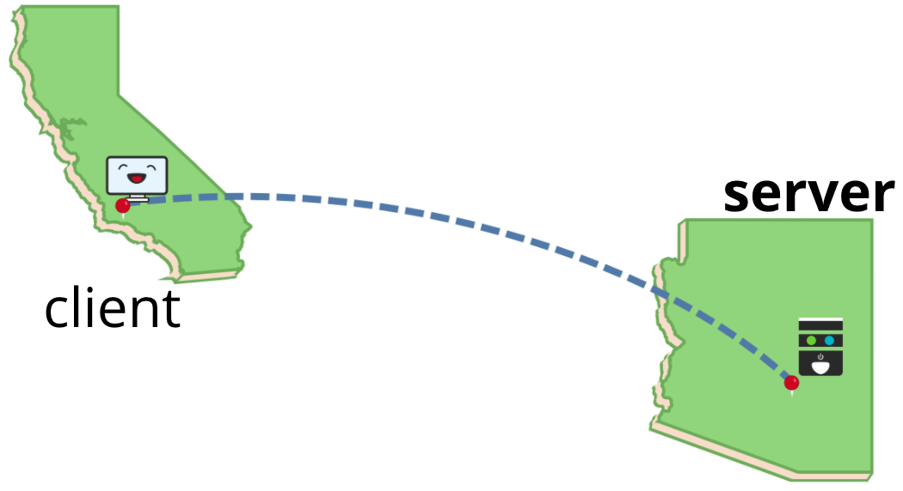
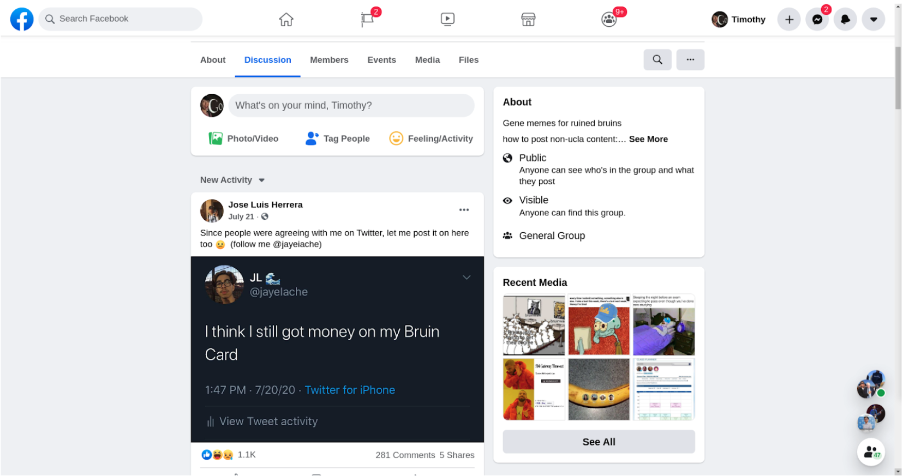
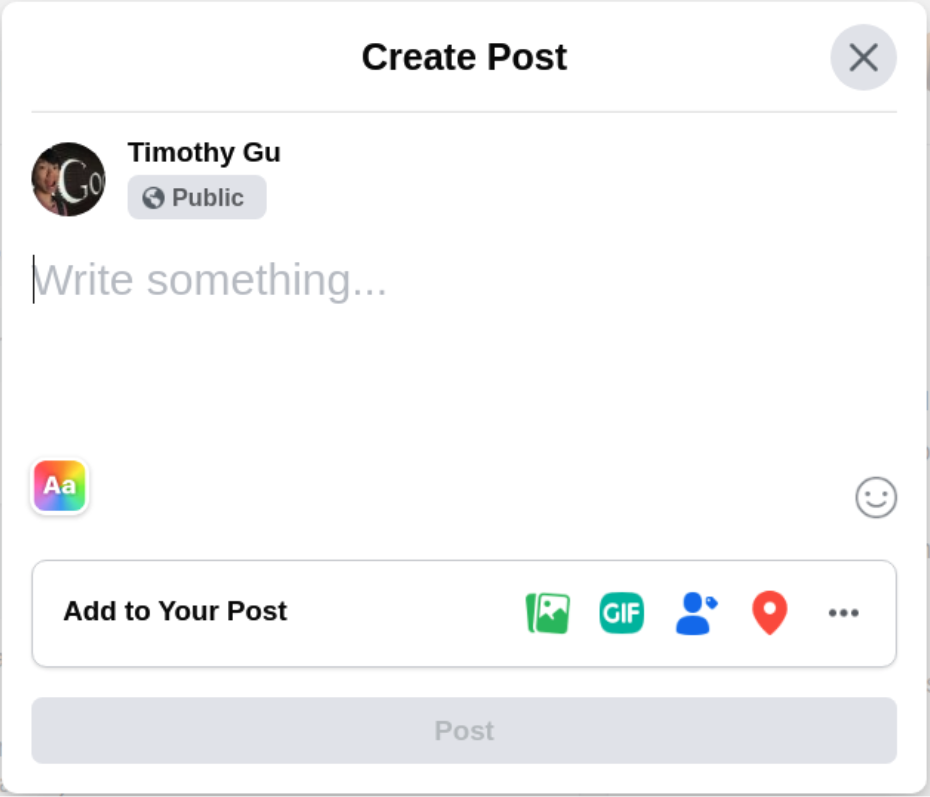
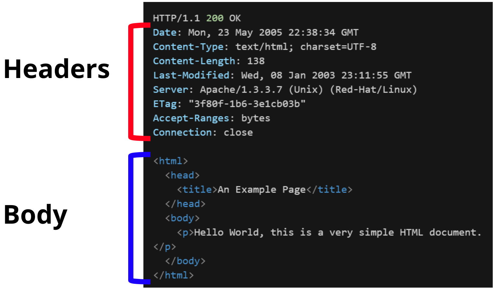
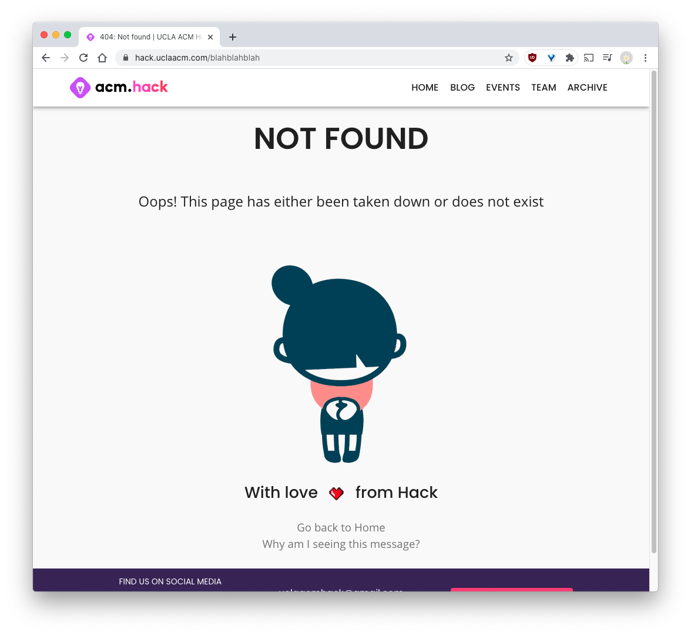
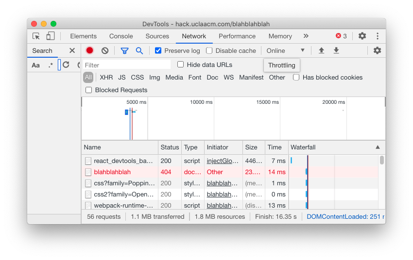
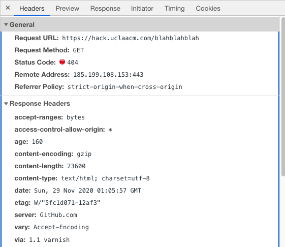
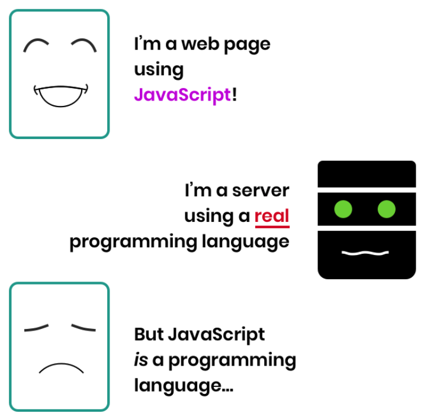
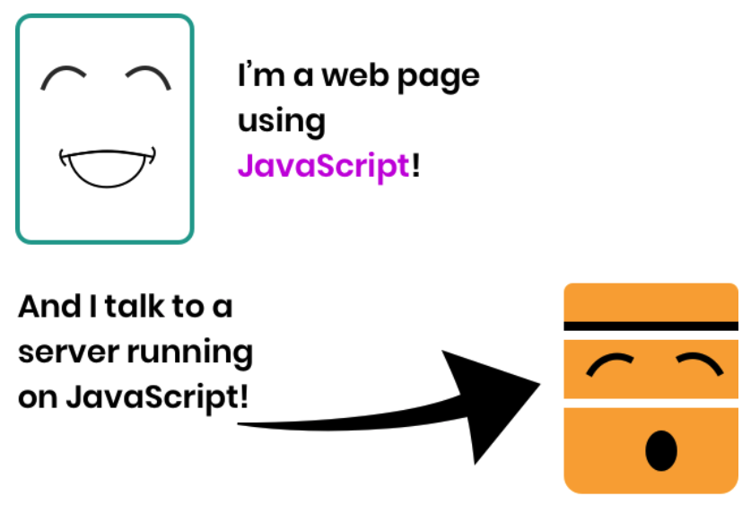

<!-- omit in toc -->
# Hackschool Bonus Session: Node.js and Servers

**Date**: Dec 2, 2020

**Location**: Zoom

**Teachers**: [Timothy Gu](https://github.com/TimothyGu), [Jamie Liu](https://github.com/jamieliu386)

<!-- omit in toc -->
## Resources

- [Slides](https://docs.google.com/presentation/d/1rqqjR0cUZ00GUgosRk4idZ7Jok8vxrNd9diy-FuEv9g/edit?usp=sharing)
- [ACM Membership Attendance Portal](http://members.uclaacm.com/login)


<!-- omit in toc -->
## What we'll be learning today
- [What is a Server?](#what-is-a-server)
- [HTTP](#http)
  - [HTTP Requests](#http-requests)
  - [HTTP Responses](#http-responses)
- [What is Node.js?](#what-is-nodejs)
- [Express.js](#expressjs)
- [Demo](#demo)

## What is a Server?

Say we made a website called Instascam, and wanted to show our friends. We
could run the code on our computer and show it to them. However, we are being
responsible and socially distancing, so we'll have to use another method.

Another possibility could be sending them all the code through email, Google
Drive, or even GitHub. However, this is inconvenient for a number of reasons.
First, our source code might be pretty large, and it would be a hassle to send
it to them for them to download. We'd also need to give them instructions on
how to run the project, which might require them to install a bunch of stuff.

How can we work around this issue? We can put our code on a **server**!
(Remember, a server is really just a computer.) This way, all we need to do is
give our friends the URL, and they can request the site from the server without
having to download the code and run it.



---

Way back in [session 1 of Hackschool](https://github.com/uclaacm/hackschool-f20/tree/main/session-1-intro-to-html-css),
we learned that when you type a URL in the browser and press "Enter", your
computer makes a request to a server to get the files for the webpage.

Let's see an example! Imagine that we want to look at the
[UCLA Memes for Sick AfTweens FB group](https://www.facebook.com/groups/UCLAmemes/)
to laugh about the pain of midterms/finals. When we click on the link to the
page, our computer makes a **request** to some Facebook server, and the server
responds with all the information required to display the page. Now, we can
look at memes!



However, the Facebook server allows us to do more than just look at memes. Maybe
we're procrastinating on studying for finals, and have made a meme instead with
our valuable time. We can actually upload this meme to Facebook by sending it
over to the Facebook server. Now, if someone else requests the page from the
server, they'll see our meme!



---

In this example, we saw two ways that the client (our computer) can communicate
with the server (a Facebook server). We can get memes from the server, and we
can also send memes to the server.

In a world with millions (or more) of computers needing to communicate
seamlessly with each other, how do we do it? Do computers send messages in
Spanish? In Morse code? What do they put inside of the message? How can we
ensure that the recipient of the message will understand what's being sent?

All of these questions imply that we need some sort of standardized way of
communicating between computers, and this is why we have HTTP.

## HTTP

### HTTP Requests

#### HTTP Methods

### HTTP Responses

Just like HTTP requests, HTTP responses contain a header and a body. The header
consists of a status code and additional HTTP headers. The body contains data
sent by the server. This can be HTML, JSON, JPEG images, plain text, and
[more](https://en.wikipedia.org/wiki/Media_type).

Here's an example of an HTTP response.

- In the first line, we see a status code of "200", with the meaning "OK".
- We also see a header called "Content-Type" set to "text/html", telling us that
  the type of the body is HTML.
- In the body, we received a small HTML page.

#### HTTP Status Codes

One very important part of the HTTP response is the status code, which
indicates whether the HTTP request was successful or not. Status codes come in
a few categories:

```
2xx (200-299): request was successful
4xx (400-499): unsuccessful, the client messed up
5xx (500-599): unsuccessful, the server messed up
(and a couple others we won't worry about)
```

For fun, check out [http.cat](https://http.cat/).

One common status code you may have seen is 404, which means "Not Found". This
could happen if you visit a page that does not exist, and usually you'll be
redirected to a 404 page to indicate the error. For example, here's what I see
when I go to [hack.uclaacm.com/blahblahblah](https://hack.uclaacm.com/blahblahblah):



I can also open the Chrome DevTools and go to the Network tab. If I refresh the
page, I see this:



In fact, I can click on "blahblahblah" to see the following response:



## What is Node.js?

Node.js is a "JavaScript runtime environment" according to Google, which isn't
the most helpful description. But not to worry, we'll explain what it means and
why Node.js is useful.

In the year 30 B.N. (Before Node), JavaScript could only be run in the browser!
However, some very intelligent people realized that JavaScript is pretty cool
and useful. So, Node.js was created!

With Node.js, we can now run JavaScript code on our own computers, even if we're
not using a web browser and even without an internet connection! Node.js uses
the same technology inside our web browsers to make JavaScript work outside the
browser! This was a huge breakthrough for JavaScript, because it meant that 
we could also use JavaScript for our servers!

Instead of this:



We now have this:



This is really nice for us as developers, because we only need to know a single
language (JavaScript) in order to write both frontend (client) and backend
(server) code! In addition, we can be sure that any JavaScript tools used are
available on both the frontend and the backend. If we were to use a different
language in the backend, we would have to look for tools written for that
language, too.

## Express.js

## Demo
